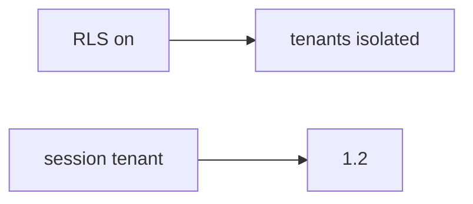

# E5-LO-07 — Transfer: clinic group practice org_id in JSON

**Kind:** transfer-challenge
**Loop step:** 7 Transfer
**Standards:** ASVS `v5.0.0-8.2.1`. API1 awareness after the cause.

## Change the workplace; keep the session as the tenant

Do not answer with a Top 10 / CWE / scanner as the definition of security.

**Prompt:** Clinic group practice switching `org_id` in JSON. Also name a Zanzibar tuple vs this binding.

**Product sketch:** EHR-lite "Postgres RLS is on so tenants are done," plus "we mapped API1 so isolation is done."

Rewrite the SecureCollab sentence. Include:

1. attacker capabilities (member of practice A sending practice B — not a live clinic tenant);
2. trust assumptions (session binding is TCB; RLS-from-body / API1 / subdomain are not);
3. forbidden outcome (`tenant_for({A},{B}) == B`, not "HIPAA");
4. a test idea on a **local** fixture only (no public EHR);
5. residual (search/cache/lake, silent impersonation, `v5.0.0-8.3.2` Level 3);
6. WCAG if support impersonation UI exists (must not look like the clinician's own org).

## Mental model: RLS sticker vs binding

## What graders reject

| Reject | Why |
|---|---|
| "we have RLS / Zanzibar" | Not this binding |
| Live clinic GraphQL | Lab policy |
| "API1 so 1.2 is done" | Awareness after the cause |

## Practice

One page. No keys. `labs/E5/e5-lab` is the only running system you may break.
