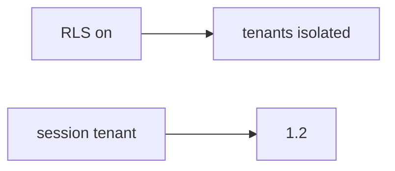

# E5-LO-07 — Transfer: clinic group practice org_id in JSON

**Kind:** transfer-challenge
**Loop step:** 7 Transfer
**Standards:** ASVS `v5.0.0-8.2.1`. API1 awareness after the cause. `v5.0.0-8.3.2` Level 3 **advanced**.

## Change the workplace; keep the session as the tenant

Do not answer with a Top 10 / CWE / scanner as the definition of security. The SecureCollab sentence was: `tenant_for({"tenant": "A"}, {"tenant": "B"})` must be `"A"`. Rewrite it for a clinic without changing the fork.

**Prompt:** Clinic group practice switching `org_id` in JSON. Also name a Zanzibar tuple vs this binding.

**Product sketch:** EHR-lite "Postgres RLS is on so tenants are done," plus "we mapped API1 so isolation is done."

Rewrite the SecureCollab sentence. Include:

1. attacker capabilities (member of practice A sending practice B — not a live clinic tenant);
2. trust assumptions (session binding is TCB; RLS-from-body / API1 / subdomain are not);
3. forbidden outcome (`tenant_for({A},{B}) == B`, not "HIPAA");
4. a test idea on a **local** fixture only (no public EHR);
5. residual (search/cache/lake, silent impersonation, `v5.0.0-8.3.2` Level 3);
6. WCAG if support impersonation UI exists (must not look like the clinician's own org).

## Mental model: RLS sticker vs binding

If RLS is “on” while `tenant_for` prefers the body, the cell is gone. A Zanzibar tuple store and an API1 mapping do not put session A in the TCB. GraphQL `org_id` is the same field. Name them, do not probe a live clinic here. API1 is a regression label *after* the body-wins cause, not the syllabus. `v5.0.0-8.3.2` is Level 3 advanced: in-session grant change, not this pytest.

The clinic rewrite still has to keep the SecureCollab fork: session A plus body B is A, matching A/A may keep A. Enabling RLS without session binding leaves `tenant_for({A},{B}) == B`. The local pytest analogue is `test_body_cannot_switch_tenant` — on a fixture, not a live EHR.

## What graders reject

| Reject | Why |
|---|---|
| "we have RLS / Zanzibar" | Not this binding |
| Live clinic GraphQL | Lab policy |
| "API1 so 1.2 is done" | Awareness after the cause |
| "subdomain is the tenant" | Client-controlled Host |
| "Gate 7 complete" | Forbidden stamp |

## Practice

One page. No keys. `labs/E5/e5-lab` is the only running system you may break. Do not probe a live tenant.

## Non-goals

Live-SaaS probes. Production GraphQL. Claiming Gate 7 or M2 from this page.
