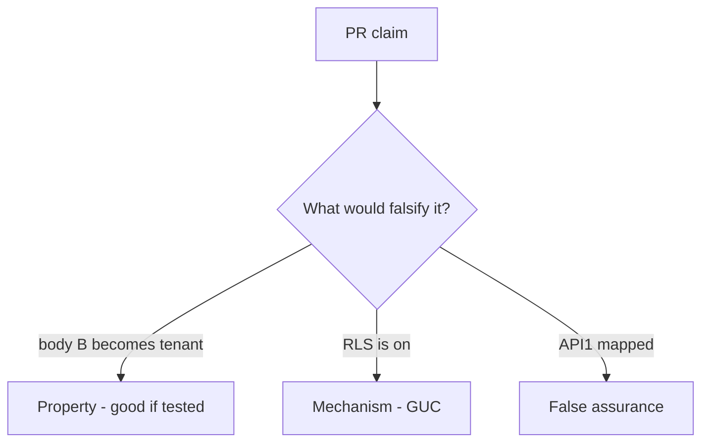

# E5-LO-08 — Review body-chosen tenant as a PR

**Kind:** code-review
**Loop step:** Review
**Standards:** ASVS `v5.0.0-8.2.1`. `v5.0.0-15.3.3` related. API1 awareness after the cause.

## Review the fixture as if it were SecureCollab’s note query

Review `labs/E5/e5-lab/vulnerable/` as a SecureCollab PR. Your job is not to count suspicious lines. Reconstruct whether `tenant_for({"tenant": "A"}, {"tenant": "B"})` still returns `"B"`, compare that with the module invariant, and write changes a developer can verify.

Intended findings live only in `content/assessment/keys/E5.md` — not here. Do not open the keys file until your review has been evaluated.

## Mental model: Tenant taken from the body

Start with this seeded smell: **Tenant taken from the body**. Label it property, mechanism, or false assurance before you accept the PR.

Classification starts at the protected effect (session A plus body B is A). Everything that is not session binding at that call is a candidate body-wins path. An RLS screenshot without that pytest is the same smell, not a different finding class.

Cache keys without tenant are residual. Silent impersonation is E6. Do not skip `test_body_cannot_switch_tenant`. Do not claim Gate 7. Do not probe a live tenant to prove the finding.

## Seeded smells (label them yourself)

- Tenant taken from the body
- RLS session var set from JSON
- Cache key without tenant
- Support impersonation silent

Also reject: live SaaS probes; shipping without re-running `test_body_cannot_switch_tenant`; keys in lessons; claiming Gate 7; treating API1 as the syllabus.

## Misconceptions this module refuses

- RLS replaces app mediation
- Subdomain is unforgeable tenant
- Scale means IAM instead of 1.2
- Zanzibar is `tenant_for`
- GraphQL `org_id` is a different cell

## Practice

Write three review notes a maintainer could act on. Each note: observation, property or false assurance, suggested structural change, residual you will **not** delete. Tie at least one to `test_body_cannot_switch_tenant`.

## Transfer

Clinic PR that "enabled RLS and mapped API1" without session binding is an incomplete tenant-gate review. Name the independent falsehood that would still keep body B from becoming the tenant.

## Non-goals

Do not merge by adding a comment “will bind later.” That comment is a residual without an owner. Do not send `org_id` to a public SaaS to prove the finding.
