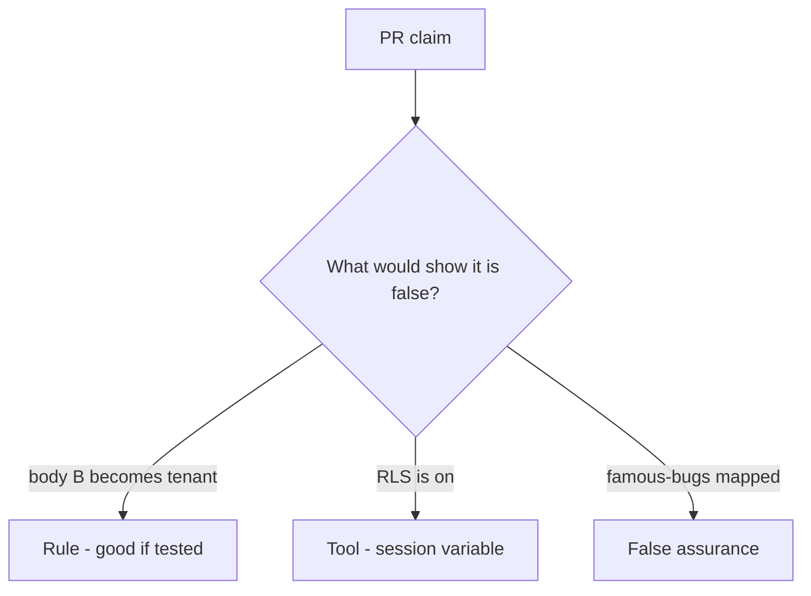

# Would you merge this body-chosen company?

**Kind:** code-review
**Loop step:** Review

## What you are reviewing

This review is about notes-app company binding. Check whether `tenant_for({"tenant": "A"}, {"tenant": "B"})` still returns `"B"`.

Treat the files in `labs/E5/e5-lab/vulnerable/` as the pull request. Review it as if it were the notes app’s note query. You already ran `test_body_cannot_switch_tenant` — that is the rule. A comment “will bind later” is not. The JSON body is not the tenant. Body tenant overrides session is the smell. Bind tenant from the session is the structural change.

## Picture: company taken from the body

**company taken from the body**.

Session A plus body B is still A. If the change never binds the session, that body-wins path is still open. A row-level screenshot does not replace that check.

Cache keys without company are leftover. Silent impersonation is a later topic. Do not skip `test_body_cannot_switch_tenant`. Do not claim a course gate. Do not probe a live company to prove the finding.

## Problems to find (name them yourself)

- Company taken from the body
- Row-level session variable set from JSON
- Cache key without company
- Support impersonation silent

Also reject: live product probes; shipping without re-running `test_body_cannot_switch_tenant`; keys in lessons; claiming a course gate; treating a famous-bugs list as the syllabus.

## Common mix-ups

- Row-level rules replace the app check
- Subdomain is an unforgeable company
- Scale means identity products instead of who-is-allowed
- A relationship-graph product is `tenant_for`
- GraphQL `org_id` is a different rule

## Practice

Write the review that would block this change. Name `test_body_cannot_switch_tenant`.

## Use it somewhere new

Clinic change that “enabled row-level rules and mapped a famous-bugs list” without session binding is an incomplete review of a body-chosen company. Name the independent falsehood that would still keep body B from becoming the company.

## What this page is not doing

Do not merge by adding a comment “will bind later.” That comment is leftover without an owner. Do not send `org_id` to a public product to prove the finding.
