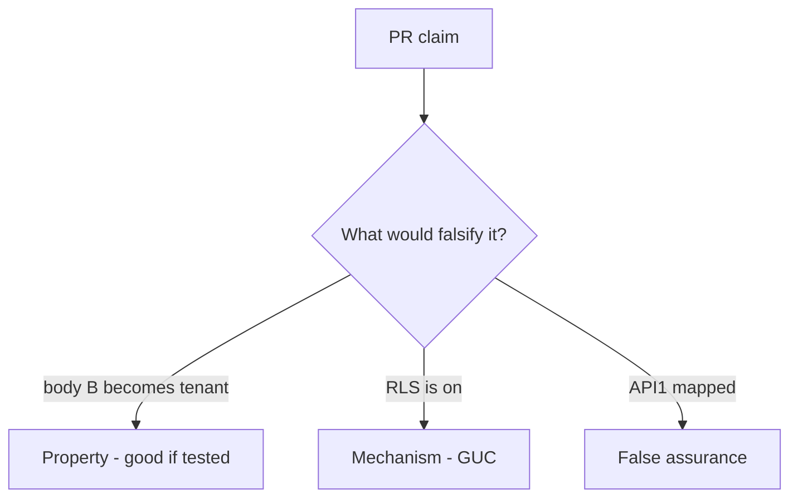

# E5-LO-08 — Review body-chosen tenant as a PR

**Kind:** code-review
**Loop step:** Review
**Standards:** ASVS `v5.0.0-8.2.1`. `v5.0.0-15.3.3` related.

## Review the fixture as if it were SecureCollab’s note query

Review `labs/E5/e5-lab/vulnerable/` as a SecureCollab PR. Intended findings live only in `content/assessment/keys/E5.md` — not here.

## Mental model: property, mechanism, or false assurance

Seeded smells (label them yourself; do not open the keys file):

- Tenant taken from the body
- RLS session var set from JSON
- Cache key without tenant
- Support impersonation silent

Also reject: live SaaS probes, keys in lessons, claiming Gate 7.

## Misconceptions

- RLS replaces app mediation
- Subdomain is unforgeable tenant
- Scale means IAM instead of 1.2

## Practice

Write three review notes. Tie at least one to `test_body_cannot_switch_tenant`.

## Transfer

Clinic PR that "enabled RLS and mapped API1" without session binding is incomplete.
