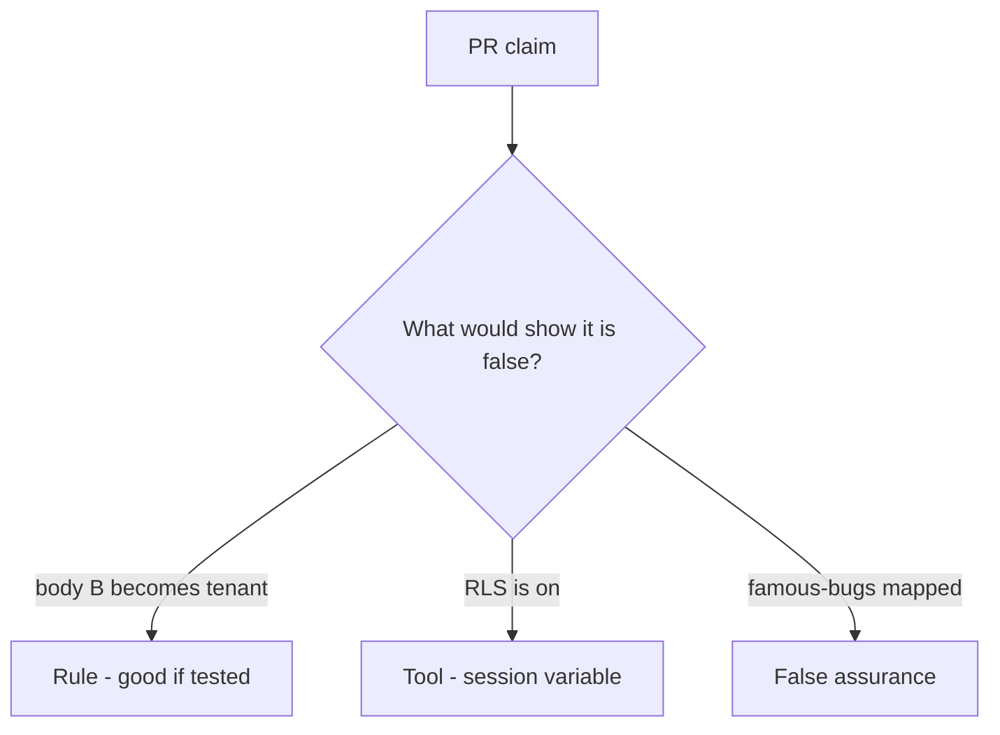

# Would you merge this body-chosen company?

**Kind:** code-review
**Loop step:** Review

## What you are reviewing

This is a company-binding review. Does `tenant_for({"tenant": "A"}, {"tenant": "B"})` still return `"B"`?

Review it as if it were the notes app’s note query. Writing “will bind later” does not make `test_body_cannot_switch_tenant` pass. The JSON body is not the tenant. Body tenant overrides session is the smell. Bind tenant from the session is the restore.

## Picture: company taken from the body

**company taken from the body**.

Session A plus body B is still A. If the change never binds the session, that body-wins path is still open. A row-level screenshot does not replace that check.

Cache keys without company are leftover. Silent impersonation is a later topic. Do not claim a course gate. Do not probe a live company to prove the finding.

## Problems to find (name them yourself)

- Company taken from the body
- Row-level session variable set from JSON
- Cache key without company
- Support impersonation silent

Also reject: live product probes; shipping without re-running `test_body_cannot_switch_tenant`; keys in lessons; claiming a course gate; treating a famous-bugs list as the syllabus.

## Common mix-ups

- Row-level rules replace the app check
- Subdomain is an unforgeable company
- Scale means identity products instead of who-is-allowed
- A relationship-graph product is `tenant_for`
- GraphQL `org_id` is a different rule

## Use it somewhere new

Row-level rules and a famous-bugs map, without session binding, still let the body choose the company. What would still keep body B from becoming the company if row-level rules are on?

## What this page is not doing

Do not ship a TODO that says you will bind later. Name who owns the bind. Do not send `org_id` to a public product to prove the finding.
