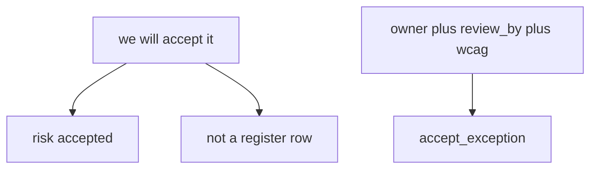
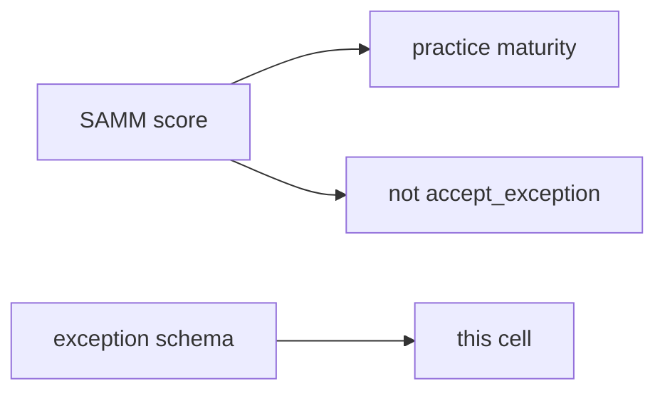

# E6-LO-01 — Oral acceptance is not a register row

**Kind:** concept-model
**Loop step:** 1 Property
**Standards:** OWASP SAMM 2.0 (final) as measurement vocabulary. NIST CSF 2.0 (final) GV as outcome labels. SSDF 1.1 (final) PW.1; SSDF 1.2 remains **draft**. CISA Secure by Design is **unverified**. ASVS `v5.0.0-15.1.5` is **Level 3, advanced**. WCAG 2.2 (final).

## The claim this module owns

SecureCollab leadership may accept residual risk. **Accountability of residual risk** is whether the exception is a **record** with an owner, a review date, and an accessibility check. “We’ll accept it” in a meeting is not that record (1.1 + 1.4 + 10.1).

> `accept_exception({"owner": "", "review_by": None})` must be false. A complete record may be accepted.

The forbidden outcome is **an incomplete exception accepted**. Unowned holes last forever; inaccessible recovery (1.4) is silently kept.

SAMM 2.0 measures practices. It is not a row in the register. CSF GV names govern outcomes. SSDF 1.1 PW.1 is design-review vocabulary. CISA Secure by Design is **unverified** manufacturer-ownership guidance, not Gate 7. `v5.0.0-15.1.5` (document dangerous functionality) is **Level 3, advanced**.

## Mental model: talk vs record



## Mental model: SAMM is not the exception



**Mechanism (not the property):** Jira “risk” issue type without dates; a Secure by Design pledge; a one-year roadmap slide.

## Root cause vs impact vs prevention vs detection vs recovery

| Slice | For this property |
|---|---|
| Root cause | Oral acceptance treated as a register row |
| Preconditions | `accept_exception` true with empty owner |
| Trigger | Calendar; silent “we’ll ship anyway” |
| Impact | Accountability of residual risk — unowned holes; inaccessible recovery |
| Prevention | Schema; refuse incomplete |
| Detection | `exception_incomplete_denied` |
| Recovery | Expire; fix or re-accept with fields |

## Framework defaults versus the register guarantee

A Jira workflow named “risk” will accept whatever fields you leave optional. Optional owner is this bug.

## Mechanism limits

- A perfect register that nobody reads.
- Rename to “tech debt.”
- Procurement questionnaire without this schema.
- CISA pledge pages that 403 (unverified).

## Usability and accessibility

The exception **must** record whether the residual includes an inaccessible control (WCAG 2.2 / 1.4). Leadership owns that users cannot complete recovery.

## Practice

Write one exception that would pass the lab. Then run:

```
python3 -m pytest labs/E6/e6-lab/tests --impl vulnerable
python3 -m pytest labs/E6/e6-lab/tests --impl fixed
```

The first command must fail. The second must pass.

## Transfer

Clinic “HIPAA exception.” Procurement questionnaire vs this record.

## Residual risk

Unread register; renamed tech-debt; `v5.0.0-15.1.5` Level 3 documentation residual.

## Non-goals

Live PSIRT. SAMM as the syllabus. Gate 7 / M2.
