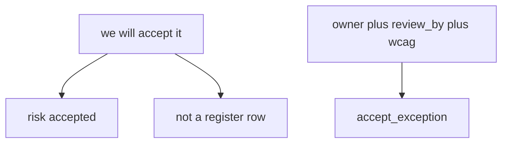
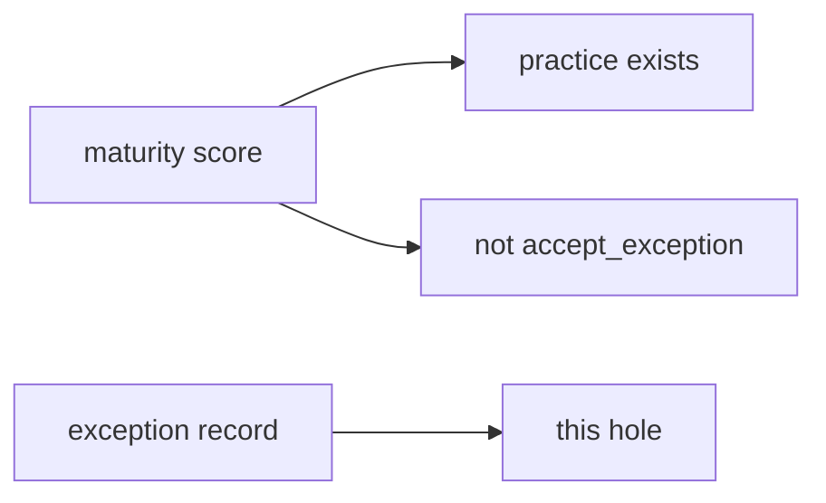

# A spoken yes is not a register row

**Kind:** concept-model
**Loop step:** 1 Property

## The rule

The notes app’s leadership may accept leftover risk. **Accountability of leftover risk** is whether the exception is a **record** with an owner, a review date, and an accessibility check. “We’ll accept it” in a meeting is not that record.

> `accept_exception({"owner": "", "review_by": None})` must be false. A complete record may be accepted.

What must not happen: **an incomplete exception accepted**. Unowned holes last forever. Inaccessible recovery (people cannot finish the reset path) is quietly kept.

A process-maturity score measures whether a practice exists somewhere. It is not a row in the register. Industry “govern” labels name outcomes. They do not write the exception. A design-review guide is vocabulary for “think while you design.” It is not `accept_exception`. An unverified “secure by design” pledge page talks about manufacturer ownership. It does not write the exception and it is not an assurance stamp. Extra advanced work — document the dangerous function — is a reason to *require* a record. It does not fill the register. A later draft of the design-review guide stays a **draft**.

The practice is this course’s local files or official labs. Do not tell anyone to try attacks on public or third-party systems.

## Picture: talk vs record



## Picture: a maturity score is not the exception



**A tool, not the rule:** a ticket type named “risk” with optional dates; a “secure by design” pledge; a one-year roadmap slide.

## Who can treat a spoken yes as a row

| Person | What they can do here | Motive | Harm if the spoken yes counts |
|---|---|---|---|
| Calendar-pressed lead | Say “we’ll accept it” and ship | Make the date | Nobody owns the hole; it never expires |
| Someone who treats a maturity score as the register | Point at a dashboard tile | “We already measure this” | The score is not owner, review date, or accessibility |
| Someone who treats a pledge as done | Paste a manufacturer page | Looks like leadership | The incomplete record still accepted |

You do not need a live disclosure inbox. Those three already accept the hole if `accept_exception` always says yes.

## Why it happens, what it costs, how you stop it, how you notice, how you recover

Oral acceptance treated as a register row. That's the oral yes. The unowned hole that lasts, or inaccessible recovery kept, is what remains.

| Slice | For this rule |
|---|---|
| Why it happens | Oral acceptance treated as a register row |
| What's already wrong | `accept_exception` true with empty owner |
| Trigger | Calendar; silent “we’ll ship anyway” |
| What it costs | Accountability of leftover risk — unowned holes; inaccessible recovery |
| How you stop it | Schema; refuse incomplete |
| How you notice | `exception_incomplete_denied` |
| How you recover | Expire; fix or re-accept with fields |

## What the framework does vs what you still have to check

A ticket workflow named “risk” will accept whatever fields you leave optional. Optional owner is this bug.

`accept_exception({"owner": "", "review_by": None})` is false, and a complete record may accept — files in `labs/E6/e6-lab`. Fake owner strings only. No live disclosure inbox. No real people’s notes.

## What the tool cannot do

- A perfect register that nobody reads.
- Rename the hole to “tech debt.”
- A procurement questionnaire without this schema.
- An unverified pledge page that does not load.

## Can people still use it

The exception **must** record whether leftover risk includes an inaccessible control. Leadership owns that people cannot complete recovery. Say that in the record, not only in a meeting.

## Practice

Write one exception that would pass the lab. Then run:

```text
python3 -m pytest labs/E6/e6-lab/tests --impl vulnerable
python3 -m pytest labs/E6/e6-lab/tests --impl fixed
```

## Use it somewhere new

Sketch a “HIPAA exception” on the notes app. Compare a procurement questionnaire to this record.

## What this page is not doing

Do not use live disclosure inboxes. Do not treat a maturity score as the syllabus. This page does not finish a check-in. Answer keys are not on this site.
