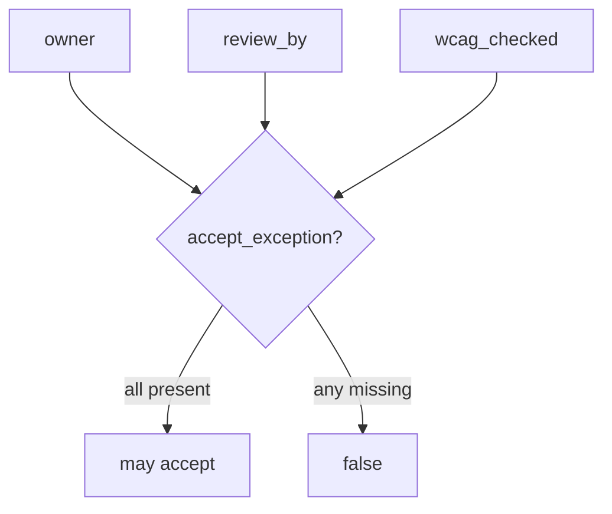
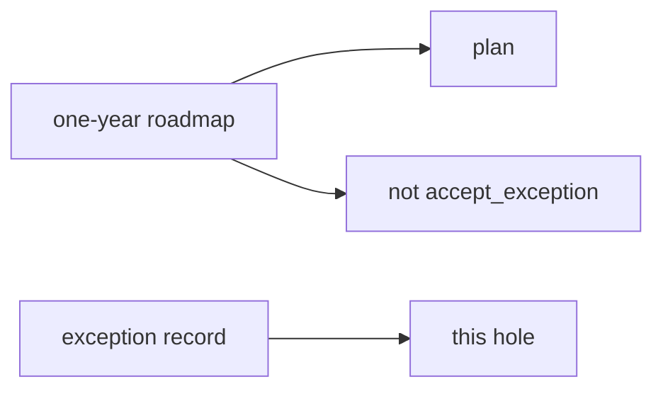

# E6-LO-02 — Owner, review date, and WCAG flag

**Kind:** design-exercise
**Loop step:** 2 Model
**Standards:** SAMM 2.0 measurement. CSF 2.0 GV. WCAG 2.2.

## Can a second engineer name the exception check from your roadmap?

“We have a risk meeting” is not this lesson. A reviewable model names **owner, review_by, wcag_checked, expiry, and who may accept**.

SecureCollab freeze: local `accept_exception(exc)`. No live disclosure inbox.

## Mental model: three required fields

## Mental model: roadmap vs row

## Step 1: freeze pieces

| Piece | This system |
|---|---|
| Subjects | product lead; silent calendar |
| Objects | residual risk; recovery path |
| Actions | `accept_exception` |
| Channels | meeting; ticket; register |
| TCB | schema of the exception |
| Untrusted | oral “we’ll accept it”; SAMM slide |
| State / time | review_by expiry |
| 1.1 cell | accountability of residual risk |

## Step 2: write cells

| Subject | Object | Action | Decision |
|---|---|---|---|
| empty owner | exception | accept | deny |
| dated owner + WCAG | exception | accept | may allow |
| SAMM score | exception | treat as row | deny |
| tech-debt rename | residual | hide | deny |

## Practice

Draw the map. Point at `labs/E6/e6-lab` file `risk.py`.

## Transfer

Clinic HIPAA exception with no review date. Same grain.

## Residual risk

Unread register. Inaccessible recovery left unchecked.

## Non-goals

Top 10 as the definition of security. Keys stay out of lessons.
