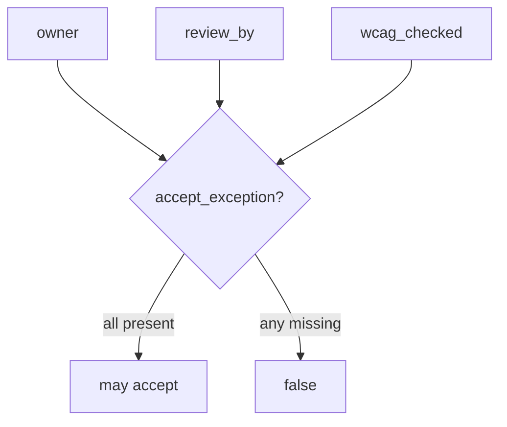
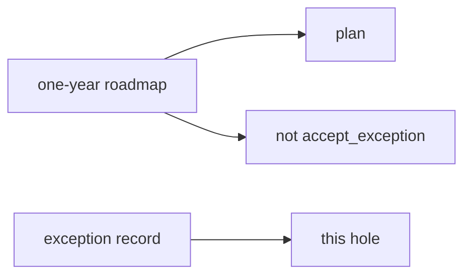

# Owner, review date, and accessibility flag

**Kind:** design-exercise
**Loop step:** 2 Model

## Could someone else name the exception check from your roadmap?

“We have a risk meeting” is not this lesson. A drawing someone else can test names **owner, review_by, wcag_checked, expiry, and who may accept**.

`accept_exception(exc)` — no live disclosure inbox.

> For accept, the rule is deny when owner is empty, deny when `review_by` is missing, and deny when `wcag_checked` is missing. A dated owner plus an accessibility flag may accept. Evidence that the deny is false: `accept_exception({"owner": "", "review_by": None})` returns true.

If those three fields are blank, the hole ships because nobody named the check.

## Picture: three required fields

## Picture: roadmap vs row

A one-year slide is a plan. It is not the hole named above. A process-maturity score still does not write the row.

## Step 1: name the pieces

Take the exception you already have and ask what would show it is still incomplete.

| Piece | This system |
|---|---|
| Who | Product lead; silent calendar |
| What | Leftover risk; recovery path |
| Actions | `accept_exception` |
| Paths | Meeting; ticket; register |
| What you trust for this journey | Schema of the exception |
| What you do not trust | Oral “we’ll accept it”; a maturity slide; a pledge page |
| Time | `review_by` expiry |
| The rule | Accountability of leftover risk |

## Step 2: write allow and deny

| Who | What | Action | Decision |
|---|---|---|---|
| empty owner | exception | accept | deny |
| dated owner + accessibility flag | exception | accept | may allow |
| maturity score | exception | treat as row | deny |
| tech-debt rename | leftover | hide | deny |

A missing owner is how a spoken yes becomes “accepted.” Write the hole.

## Practice

In `labs/E6/e6-lab`, mark `risk.py`.

## Use it somewhere new

A HIPAA exception with no review date is the same grain.

## What can still go wrong

Unread register. Inaccessible recovery left unchecked. Anyone can type an owner string.

## What this page is not doing

Answer keys are not on this site.
