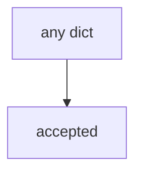

# E6-LO-03 — Observe always-accept, do not open a live PSIRT

**Kind:** mechanism-lab
**Loop step:** 3 Break
**Standards:** SAMM 2.0 as vocabulary. Lab policy: local only.

## Authorized scope

`labs/E6/e6-lab` only. Synthetic owner strings. Do **not** file a real CVE, email a vendor PSIRT, or accept a production exception as the exercise.

**Forbidden outcome:** Risk exception accepted without owner and review date.

## Mental model: everything ships



`--impl vulnerable` returns true for every payload, including empty owner.

## What to read in the fixture

`vulnerable/risk.py` always accepts. Tests require `accept_exception({"owner": "", "review_by": None})` is false. Do not treat this as a disclosure tutorial.

## Root cause vs impact

| Slice | Lab |
|---|---|
| Root cause | Oral acceptance treated as a register row |
| Impact | Unowned residual; inaccessible recovery kept |
| Not the lesson | A SAMM dashboard as the definition |

## Practice

```
python3 -m pytest labs/E6/e6-lab/tests --impl vulnerable
```

Record `test_exception_needs_owner_review_and_wcag`. Do not contact live PSIRTs.

## Transfer

Clinic HIPAA exception: predict acceptance without leaving this directory.

## Non-goals

No live-disclosure, production-exception, or public-bug-bounty instructions.
