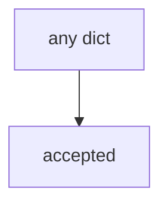

# E6-LO-03 — Observe always-accept, do not open a live PSIRT

**Kind:** mechanism-lab
**Loop step:** 3 Break
**Standards:** OWASP SAMM 2.0 (final) as measurement vocabulary. NIST CSF 2.0 GV as outcome labels. SSDF 1.1 (final) PW.1; SSDF 1.2 remains **draft**. CISA Secure by Design is **unverified**. ASVS `v5.0.0-15.1.5` is **Level 3, advanced**. WCAG 2.2 (final). Lab policy: local only.

## Authorized scope

`labs/E6/e6-lab` only. The fixture is an in-process `accept_exception(exc)`. Synthetic owner strings. Do **not** file a real CVE, email a vendor PSIRT, or accept a production exception as the exercise.

**Forbidden outcome:** Risk exception accepted without owner and review date. `accept_exception({"owner": "", "review_by": None})` returns true.

Attacker capability in this lab: calendar pressure plus oral “we’ll accept it.” That stands in for “legal said yes,” a SAMM score treated as the register, or a Secure by Design pledge treated as Gate 7. Trust assumption: `accept_exception` is supposed to require a **record** with owner, review date, and WCAG check. Jira issue types, FastAPI, and a HIPAA slide are not in the TCB for this cell.

## Mental model: everything ships



`--impl vulnerable` returns true for every payload, including empty owner. Preconditions: incomplete dicts accept. You do not need a GRC tool. You must not contact a live PSIRT. Do not treat this as a disclosure tutorial.

SAMM 2.0 measures practices. It is not a row. Module 1.1 / 1.4 / 10.1 already said posters are not gates; this cell is **accountability of residual risk**. Gate 7 and M2 stay **not-attempted**.

## What to read in the fixture

`vulnerable/risk.py` always accepts. Tests:

- `test_exception_needs_owner_review_and_wcag`
- `test_complete_exception_may_be_accepted` — alice + date + WCAG may pass on both

You do not need a new field. The failure of `test_exception_needs_owner_review_and_wcag` *is* the evidence.

Do not open the fixed tree yet. Diagnose the cause first.

## Root cause vs impact vs prevention vs detection vs recovery

| Slice | This lab |
|---|---|
| Required property | empty owner → accept_exception false |
| Root cause | Oral acceptance treated as a register row |
| Preconditions | always-true accept_exception |
| Trigger | Calendar; silent “we’ll ship anyway” |
| Impact | Unowned holes last; inaccessible recovery kept |
| Prevention | Schema; refuse incomplete |
| Detection | `exception_incomplete_denied`; never secret writeups |
| Recovery | Expire; fix or re-accept with fields |
| Not the lesson | A SAMM dashboard; live PSIRT; Gate 7 complete |

## Framework defaults versus the register guarantee

A Jira “risk” type will close without dates if you let it. CSF GV names govern outcomes; it does not write the row. CISA Secure by Design is unverified manufacturer guidance. The application guarantee is: **this** fixture, empty owner is deny.

## Practice

```text
python3 -m pytest labs/E6/e6-lab/tests --impl vulnerable
```

Run from `labs/E6/e6-lab` if a repo-root collection picks up `site/`. Record `test_exception_needs_owner_review_and_wcag`. Do not contact live PSIRTs. An environment error is not security evidence.

## Transfer

Clinic HIPAA exception: predict acceptance without leaving this directory. Do not open a live GRC tenant.

## Non-goals

No live-disclosure, production-exception, or public-bug-bounty instructions. Do not claim Gate 7. SSDF 1.2 stays draft. CISA Secure by Design stays unverified.
