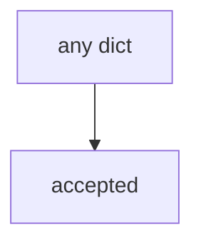

# Practice: always-accept exception

**Kind:** mechanism-lab
**Loop step:** 3 Break

## Try it

The practice is not a website you attack. `accept_exception` returns true for every dict: it never looks at owner, review date, or accessibility, so an incomplete hole already counts as accepted.

> An exception must not be accepted without owner, review date, and an accessibility check. If `accept_exception({"owner": "", "review_by": None})` returns true, the register gate has failed as a security control.

## Where you may practice

Stay inside `labs/E6/e6-lab`. Owner strings are fake. Do **not** file a real public bug, email a vendor disclosure inbox, or accept a production exception as the exercise.

Do not paste this exercise onto a public clinic, employer register, or live hospital portal “to see what happens.”

`accept_exception` is supposed to require a **record** with owner, review date, and accessibility flag — not A ticket type, a HIPAA slide, or a pledge page.

Picture calendar pressure plus oral “we’ll accept it” — “legal said yes,” a maturity score treated as the register, or a “secure by design” pledge treated as an assurance stamp.

## Picture: everything ships



`--impl vulnerable` returns true for every payload, including empty owner. You do not need a governance product. You must not contact a live disclosure inbox. The true return for empty owner is already the leak.

Earlier lessons already said posters are not gates. This check is **accountability of leftover risk**.

## What to look at: the cause, not a hunt

`vulnerable/risk.py` returns true for every dict. Tests:

- `test_exception_needs_owner_review_and_wcag`
- `test_complete_exception_may_be_accepted` — alice + date + accessibility flag may pass on both


| What you see | What kind of failure | Not the lesson |
|---|---|---|
| `return True` for every dict | Oral acceptance treated as a row | “Legal said yes” |
| empty owner still accepted | What must not happen is allowed | A maturity dashboard |
| missing `review_by` still accepted | No expiry | A pledge screenshot |

## Why it happens vs what it costs

| Slice | Practice |
|---|---|
| The rule | empty owner → `accept_exception` false |
| Why it happens | Oral acceptance treated as a register row |
| What's already wrong | always-true `accept_exception` |
| Trigger | Calendar; silent “we’ll ship anyway” |
| What it costs | Unowned holes last; inaccessible recovery kept |
| How you stop it later | Schema; refuse incomplete |
| How you notice later | `exception_incomplete_denied`; never secret writeups |
| How you recover later | Expire; fix or re-accept with fields |
| Out of scope | A maturity dashboard; live disclosure; claiming an assurance gate |

A ticket type named “risk” will close without dates if you let it. Industry “govern” labels name outcomes; they do not write the row. An unverified pledge is manufacturer talk, not this function. Empty owner is deny.

## Practice

```text
python3 -m pytest labs/E6/e6-lab/tests --impl vulnerable
```

Run from `labs/E6/e6-lab` if a collection at the repo root picks up `site/`. Do not contact live disclosure inboxes. A setup error is not proof the rule holds.

## Use it somewhere new

Clinic HIPAA exception: predict acceptance without leaving this directory. Do not open a live governance tenant.

## What this page is not doing

No live-disclosure, production-exception, or public-bug-bounty instructions. This page does not mark you as finished. A later design-review draft stays a draft. An unverified pledge stays unverified.
