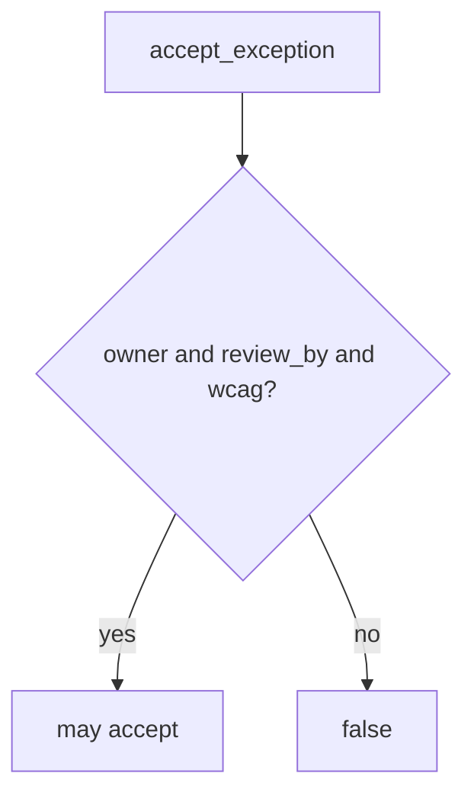

# E6-LO-04 — Require owner, review_by, and wcag_checked

**Kind:** design-exercise
**Loop step:** 4 Build
**Standards:** WCAG 2.2 (final). SSDF 1.1 PW.1 as vocabulary. SAMM 2.0 as measurement, not the predicate. ASVS `v5.0.0-15.1.5` is **Level 3, advanced**.

## Structural means the runtime checks the schema

`accept_exception` must be true only when `owner`, `review_by`, and `wcag_checked` are present. Fail-safe: incomplete records deny. A SAMM score may *accompany* the register; it does not replace the row. Structural means that schema — not “the VP said yes,” not a HIPAA slide, not a CISA pledge.

The smallest restore for SecureCollab leadership is: empty owner → false; alice + date + WCAG may accept. Do not fail open because the meeting notes look complete. Do not silently extend past `review_by`.

## Mental model: schema gate



Do not accept “the VP said yes” as membership. Production still needs someone to *read* the register — an unread complete row is a residual. Inaccessible recovery (1.4) is recorded as a flag here, not proven. `v5.0.0-15.1.5` (document dangerous functionality) is Level 3 advanced: documentation, not this pytest.

Expire on `review_by`. Re-accept with fields or fix the hole. Do not silently extend.

SSDF 1.1 PW.1 is design-review vocabulary. This pytest is that sentence for incomplete exceptions.

## Why this restores the cell

| After the fix | Must be true |
|---|---|
| empty owner | false |
| alice + date + WCAG | may be true |

## What this is not

SAMM 2.0. CSF GV sticker. CISA pledge. Gate 7 / M2. `v5.0.0-15.1.5` Level 3 documentation residual. A procurement questionnaire.

## Mechanism limits

- Anyone can type an owner string.
- Unread register remains residual.
- Rename to “tech-debt” can hide the row.
- `wcag_checked` is a flag, not a WCAG audit.
- SSDF 1.2 IPD stays draft.

## Practice

Name who can be `owner`. Run:

```text
python3 -m pytest labs/E6/e6-lab/tests --impl fixed
```

Must pass. Run from the lab directory if collection at repo root is polluted.

## Transfer

Clinic: refuse a HIPAA exception with no review date the same way.

## Residual risk

Unread register; rename to tech-debt; inaccessible path still checked only as a flag; `v5.0.0-15.1.5` Level 3.

## Non-goals

Do not file a live exception. Do not claim Gate 7 from a SAMM screenshot. Do not present CISA Secure by Design as verified.
