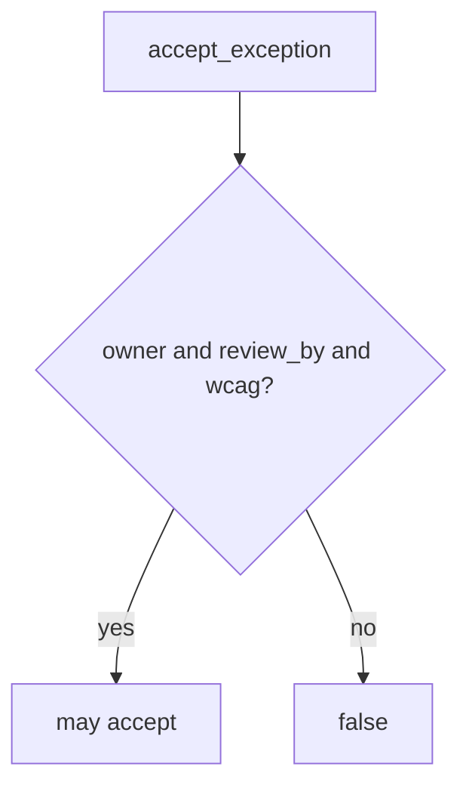

# E6-LO-04 — Require owner, review_by, and wcag_checked

**Kind:** design-exercise
**Loop step:** 4 Build
**Standards:** WCAG 2.2 (final). SSDF 1.1 PW.1 as vocabulary.

## Structural means the runtime checks the schema

`accept_exception` must be true only when `owner`, `review_by`, and `wcag_checked` are present. Fail-safe: incomplete records deny. A SAMM score may *accompany* the register; it does not replace the row.

## Mental model: schema gate



Do not accept “the VP said yes” as membership.

## Why this restores the cell

| After the fix | Must be true |
|---|---|
| empty owner | false |
| alice + date + WCAG | may be true |

## What this is not

SAMM 2.0. CSF GV sticker. CISA pledge. Gate 7 / M2. `v5.0.0-15.1.5` Level 3 documentation residual.

Expire on `review_by`. Re-accept with fields or fix the hole. Do not silently extend.

## Practice

Name who can be `owner`. Run:

```
python3 -m pytest labs/E6/e6-lab/tests --impl fixed
```

Must pass.

## Transfer

Clinic: refuse a HIPAA exception with no review date the same way.

## Residual risk

Unread register; rename to tech-debt; inaccessible path still checked only as a flag.
