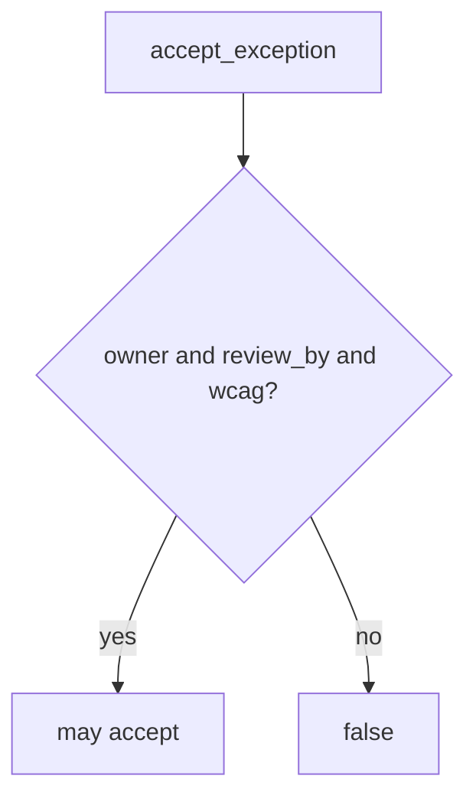

# Require owner, review_by, and wcag_checked

**Kind:** design-exercise
**Loop step:** 4 Build

## The rule

A spoken “yes” is not the fix. A maturity score is not the fix. “The VP said yes so we shipped” is not the fix.

The structural change is: `accept_exception` **returns true only when `owner`, `review_by`, and `wcag_checked` are present**. Incomplete records deny. A maturity score may *accompany* the register; it does not replace the row. Structural means that schema — not “the VP said yes,” not a HIPAA slide, not a pledge.

The smallest fix for the notes app’s leftover-risk record is: empty owner → false; alice + date + accessibility flag may accept. Fail-safe: a missing field is deny. Do not fail open because the meeting notes look complete. Do not silently extend past `review_by`.

## Picture: schema gate



The repaired files require those three fields. Production still needs someone to *read* the register — an unread complete row is leftover. Inaccessible recovery is recorded as a flag here, not proven. Extra advanced documentation of a dangerous function is documentation, not this check.

Expire on `review_by`. Re-accept with fields or fix the hole. Do not silently extend.

A design-review guide is vocabulary — incomplete exceptions.

## What the repaired files must show

Do not treat `fixed/risk.py` as a production register product.

| After the fix | Must be true |
|---|---|
| empty owner | false |
| alice + date + accessibility flag | may be true |

Fail closed: if you are unsure whether the record is complete, deny. Uncertainty is a **no** on accept, not a yes because the meeting happened.

## What this is not

- A process-maturity score.
- An industry “govern” sticker.
- An unverified pledge.
- An assurance-gate stamp.
- Extra advanced documentation of a dangerous function.
- A procurement questionnaire.

## What the tool cannot do

- Anyone can type an owner string.
- Unread register remains leftover.
- Rename to “tech-debt” can hide the row.
- `wcag_checked` is a flag, not a full accessibility audit.
- A later design-review draft stays a draft.

## Practice

Name who can be `owner`. Run:

```text
python3 -m pytest labs/E6/e6-lab/tests --impl fixed
```

## Use it somewhere new

A clinic example: refuse a HIPAA exception with no review date the same way. The lab still uses fake strings.

## What can still go wrong

Unread register; rename to tech-debt; inaccessible path still checked only as a flag; extra advanced documentation leftover.

## What this page is not doing

Do not file a live exception. This page does not mark you as finished. A maturity screenshot is not a check-in. Do not present an unverified pledge as proven.
