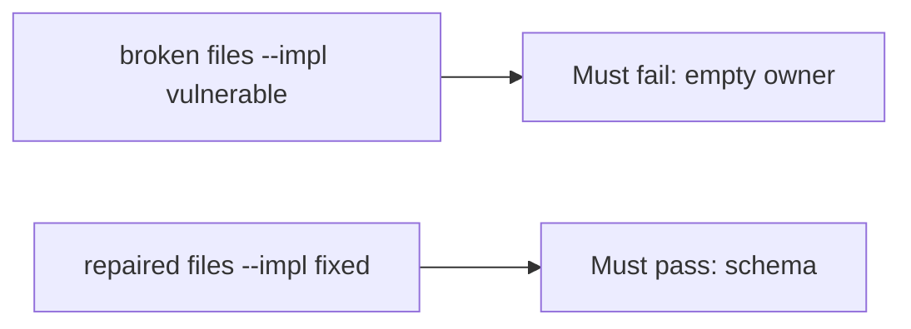

# A broken register gate must fail the check

**Kind:** verification-lab
**Loop step:** 5 Verify

## Check it

A maturity score does not accept an empty owner. “Legal said yes” is a conversation. `accept_exception({"owner": "", "review_by": None})` has to be false, and a complete record may accept. On the broken files the empty owner still accepts. On the repaired files it does not. Do not file live exceptions.

## Picture: a broken register gate must fail the check

A passing-test tally can still hide that empty owner still accepts.



If both pass, you are not looking at empty owner.

## What the check has to show

| Mode | Must show for this topic |
|---|---|
| Wrong input | empty owner → false; broken files must fail |
| Abuse | missing `review_by` or `wcag_checked` → deny |
| Normal | complete record may accept (may pass on both) |
| Not claimed | a maturity dashboard; a pledge; an assurance gate; that anyone reads the register |

The test `test_exception_needs_owner_review_and_wcag` is there so always-accept `accept_exception` still fails.

A complete exception row may pass on both sides. You still have to deny a row with no owner. If the broken files do not fail `test_exception_needs_owner_review_and_wcag`, the lab is miswired — fix the wiring, not the assertion.

```text
python3 -m pytest labs/E6/e6-lab/tests --impl vulnerable
python3 -m pytest labs/E6/e6-lab/tests --impl fixed
```

A maturity name on a slide is not `accept_exception({"owner": "", "review_by": None})`. This practice never opens a live host.

## What the tests do not prove

- Anyone reads the register
- A disclosure inbox actually discloses
- A later design-review draft (still a draft)
- An unverified “secure by design” pledge
- Extra advanced documentation of a dangerous function
- This page does not finish a maturity check-in

## Practice

Call `accept_exception({"owner": "", "review_by": None})`. A maturity name on a slide is a score, not the schema.

## Use it somewhere new

A HIPAA slide is a deck, not an owner on the exception. Do not use a live governance tool.

## What this page is not doing

A live disclosure screenshot is not an owner on the exception. Do not log secret writeups. Answer keys are not on this site. This page does not mark you as finished.
