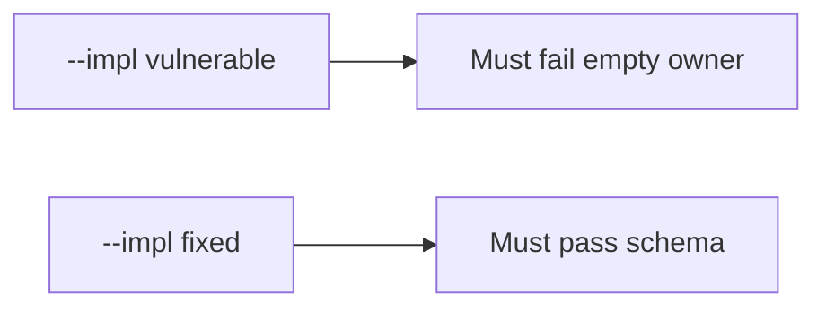

# E6-LO-05 — Evidence is incomplete exception denied, then a passing pair

**Kind:** verification-lab
**Loop step:** 5 Verify
**Standards:** SAMM 2.0 as vocabulary, not the oracle. WCAG 2.2 as the schema field, not a full audit.

## An invariant that cannot fail a test is still a slogan

“We do SAMM” is not evidence. “Legal said yes” is a mechanism observation. The oracle is: `accept_exception({"owner": "", "review_by": None})` is false and a complete record may accept. The empty-owner observation must be **false** on `--impl vulnerable` (returns true) and **true** on `--impl fixed`. Do not file live exceptions.

## Mental model: vulnerable must fail: empty owner

The failing observation on `--impl vulnerable` is **empty owner**. A passing collection count is not this cell.



| Mode | Must show for this module |
|---|---|
| Negative / abuse | empty owner → false; vulnerable must fail |
| Normal | complete record may accept (may pass on both) |
| Not claimed | SAMM dashboard; CISA pledge; Gate 7; that anyone reads the register |

Lab tests in `labs/E6/e6-lab/tests/test_property.py`. `test_exception_needs_owner_review_and_wcag` is a **forbidden-outcome** test: always-accept `accept_exception` is not allowed to count as a passing control.

```text
python3 -m pytest labs/E6/e6-lab/tests --impl vulnerable
python3 -m pytest labs/E6/e6-lab/tests --impl fixed
```

Honest complete exceptions may pass on both implementations. That does not excuse the empty-owner deny test. If vulnerable does not fail `test_exception_needs_owner_review_and_wcag`, the lab is miswired—fix the wiring, not the assertion.

## What the tests do not prove

- Anyone reads the register
- PSIRT actually discloses
- SSDF 1.2 (still draft)
- CISA Secure by Design (unverified)
- `v5.0.0-15.1.5` Level 3 documentation
- Gate 7 / M2 complete

Record those as residuals or later modules, not as silent passes.

## Practice

Execute both implementations this session from the lab directory if needed. Write the fail/pass pair next to the matrix row. Reject a “test” that only greps `SAMM` in a slide without calling `accept_exception({"owner": "", "review_by": None})`.

## Transfer

Clinic: a test that only asserts “we have a HIPAA slide” is not this cell. A live GRC tool is out of scope.

## Non-goals

Do not add a live-PSIRT trophy. Do not log secret writeups. Keys stay out of this file. Gate 7 stays not-attempted.
