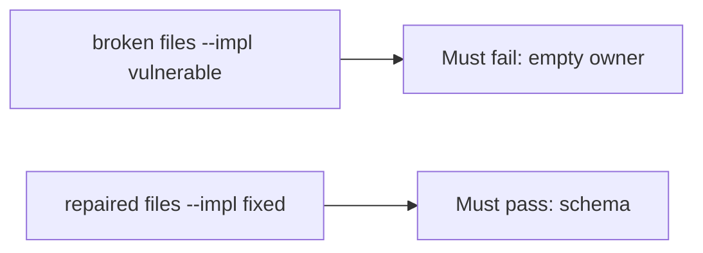

# A broken register gate must fail the check

**Kind:** verification-lab
**Loop step:** 5 Verify

## Check it

“We measure maturity” is not evidence. “Legal said yes” is a tool observation. The check is: `accept_exception({"owner": "", "review_by": None})` is false and a complete record may accept. The empty-owner observation must be **false** on the broken files and **true** on the repaired files. Do not file live exceptions.

## Picture: a broken register gate must fail the check

A check that only counts passing tests can still look green while empty owner still accepts.



If both pass, the test is not looking at empty owner.

## What the check has to show

| Mode | Must show for this topic |
|---|---|
| Wrong input | empty owner → false; broken files must fail |
| Abuse | missing `review_by` or `wcag_checked` → deny |
| Normal | complete record may accept (may pass on both) |
| Not claimed | a maturity dashboard; a pledge; an assurance gate; that anyone reads the register |

The test `test_exception_needs_owner_review_and_wcag` is there so always-accept `accept_exception` still fails.

Honest complete exceptions may pass on both implementations. That does not excuse the empty-owner deny test. If the broken files do not fail `test_exception_needs_owner_review_and_wcag`, the lab is miswired — fix the wiring, not the assertion.

```text
python3 -m pytest labs/E6/e6-lab/tests --impl vulnerable
python3 -m pytest labs/E6/e6-lab/tests --impl fixed
```

A test that only greps a maturity name in a slide without calling `accept_exception({"owner": "", "review_by": None})` is not this topic’s evidence. This practice never opens a live host.

## What the tests do not prove

- Anyone reads the register
- A disclosure inbox actually discloses
- A later design-review draft (still a draft)
- An unverified “secure by design” pledge
- Extra advanced documentation of a dangerous function
- An assurance gate complete

## Practice

```text
python3 -m pytest labs/E6/e6-lab/tests --impl vulnerable
python3 -m pytest labs/E6/e6-lab/tests --impl fixed
```

Reject a “test” that only greps a maturity name without calling `accept_exception({"owner": "", "review_by": None})`.

## Use it somewhere new

A clinic example: a test that only asserts “we have a HIPAA slide” is not this topic. A live governance tool is out of scope.

## What this page is not doing

Do not treat a live disclosure screenshot as proof. Do not log secret writeups. Answer keys are not on this site. This page does not mark you as finished.
