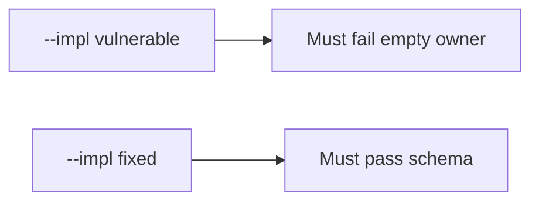

# E6-LO-05 — Evidence is incomplete exception denied, then a passing pair

**Kind:** verification-lab
**Loop step:** 5 Verify
**Standards:** SAMM 2.0 as vocabulary, not the oracle.

## An invariant that cannot fail a test is still a slogan

“We do SAMM” is not evidence. The oracle is the local pair. Do not file live exceptions.

## Mental model: vulnerable must fail: empty owner

The failing observation on `--impl vulnerable` is **empty owner**. A passing collection count is not this cell.



| Case | Must show |
|---|---|
| Negative / abuse | empty owner → false |
| Normal | complete record may accept |
| Not claimed | SAMM dashboard; CISA pledge; Gate 7 |

```
python3 -m pytest labs/E6/e6-lab/tests --impl vulnerable
python3 -m pytest labs/E6/e6-lab/tests --impl fixed
```

Honest complete exceptions may pass on both.

## What the tests do not prove

- Anyone reads the register
- PSIRT actually discloses
- SSDF 1.2 (still draft)
- CISA Secure by Design (unverified)

## Practice

Execute both implementations. Map each test to an LO-02 cell.

## Transfer

Clinic: a test that only asserts “we have a HIPAA slide” is not this cell.
