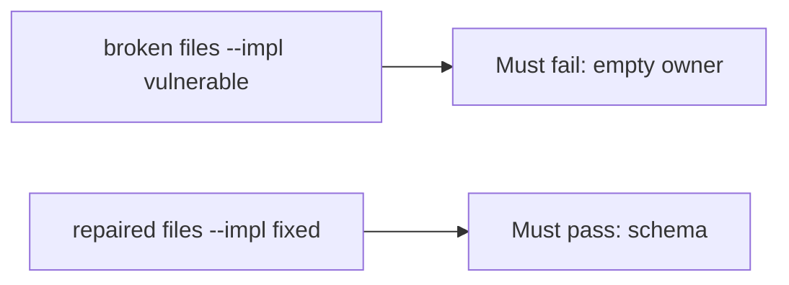

# Fail on the broken files, then pass on the repaired ones

**Kind:** verification-lab
**Loop step:** 5 Verify

## If you cannot test it, it is still a slogan

“We measure maturity” is not evidence. “Legal said yes” is a tool observation. The check is: `accept_exception({"owner": "", "review_by": None})` is false and a complete record may accept. The empty-owner observation must be **false** on the broken files and **true** on the repaired files. Do not file live exceptions.

## Picture: a broken register gate must fail the check

A test that only counts passing tests can pass while empty owner still accepts. This check asks whether an incomplete exception still counts as a passing control. Broken must fail that question. Repaired must pass it.



If both pass, the test is not looking at empty owner. If both fail, the fix is not structural or the check is wrong.

## Four modes, even for an exception dict

| Mode | Must show for this topic |
|---|---|
| Wrong input | empty owner → false; broken files must fail |
| Abuse | missing `review_by` or `wcag_checked` → deny |
| Normal | complete record may accept (may pass on both) |
| Not claimed | a maturity dashboard; a pledge; an assurance gate; that anyone reads the register |

The file is `labs/E6/e6-lab/tests/test_property.py`. The test `test_exception_needs_owner_review_and_wcag` is a **what-must-not-happen** test: always-accept `accept_exception` is not allowed to count as a passing control.

Honest complete exceptions may pass on both implementations. That does not excuse the empty-owner deny test. If the broken files do not fail `test_exception_needs_owner_review_and_wcag`, the lab is miswired — fix the wiring, not the assertion.

```text
python3 -m pytest labs/E6/e6-lab/tests --impl vulnerable
python3 -m pytest labs/E6/e6-lab/tests --impl fixed
```

A test that only greps a maturity name in a slide without calling `accept_exception({"owner": "", "review_by": None})` is not this topic’s evidence. This practice never opens a live host.

## What the tests do not prove

- Anyone reads the register
- A disclosure inbox actually discloses
- A later design-review draft (still a draft)
- An unverified “secure by design” pledge
- Extra advanced documentation of a dangerous function
- An assurance gate complete

Record those as leftover or later topics, not as silent passes.

## Practice

Run both this session from the lab directory if needed:

```text
python3 -m pytest labs/E6/e6-lab/tests --impl vulnerable
python3 -m pytest labs/E6/e6-lab/tests --impl fixed
```

Paste nothing from answer keys. Write fail/pass into your notes next to the incomplete-exception row. Reject a “test” that only greps a maturity name without calling `accept_exception({"owner": "", "review_by": None})`.

## Use it somewhere new

Clinic: a test that only asserts “we have a HIPAA slide” is not this topic. A live governance tool is out of scope.

## What this page is not doing

Do not add a live-disclosure trophy. Do not log secret writeups. Answer keys stay out of this file. Do not claim you finished an assurance gate.
