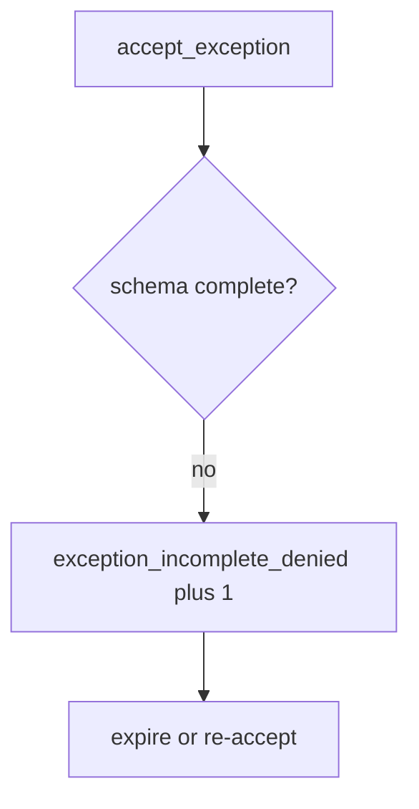

# Log the incomplete exception, not the secrets

**Kind:** operations-exercise
**Loop step:** 6 Operate

## Fixing it once is not enough

A “fast-track risk” form can drop `review_by`. Keep leftover-risk writeups that contain secrets, and chart text, out of the ticket.

## Picture: incomplete row is a signal

If an accept skips owner, review date, or accessibility, page the missing fields — not the secrets. Then expire the hole or re-accept with a complete record.



A schema screenshot still leaves owner, review date, and accessibility empty.

Blank owner or `review_by` still has to make `test_exception_needs_owner_review_and_wcag` fail. A maturity 2.5 tile does not fill owner, review date, and accessibility. Expired `review_by` dates are the same unowned hole; do not accept the exception until those rows are named.

## Signals that do not become a second leak

| Outcome | This topic |
|---|---|
| Notice | `exception_incomplete_denied` |
| What the line holds | Missing fields, proposed owner; **never** secret writeups |
| Respond | Stop the accept that ignored the schema; do not paste secrets into chat |
| Recover | Expire; fix or re-accept with fields |
| Leftover | Unread register; tech-debt rename |

A governance dashboard will show exception counts and stay silent when CI’s `accept_exception` is always true. Detection must observe **empty owner is deny**, not “we have a risk register.” If the alert includes a secret writeup or chart text, you have opened a leftover-secret leak.

```text
log_denied reason=exception_incomplete_denied missing=owner,review_by
```

A secret, a “check-in complete,” or a pledge screenshot on that sample is already a trophy wall.

A matching writeup in the exception alert copies the trophy into the ticket.

## What the framework does vs what you still have to check

Always-true accept, unread register rows, and renamed tech-debt still skip owner and `review_by` even if the risk dashboard is green. A maturity score does not fill those fields.

Oral acceptance treated as a row is the skipped check. Unowned leftover and inaccessible recovery kept is what remains. Ship the schema. Page `exception_incomplete_denied`. Recover by expiring or re-accepting. The ticket does not prove anyone reads the register, and it does not verify the accessibility flag.

## Can people still use it

The exception must record whether people can complete recovery. The deny message must say *missing owner / review date / accessibility check*, not only “assert False.” Under stress, do not use color-only severity.

## Practice

```text
log_denied reason=exception_incomplete_denied missing=owner,review_by
```

A secret, a “check-in complete,” or a pledge screenshot would turn the log into a trophy wall.

## Use it somewhere new

Deny the HIPAA exception; do not paste chart text into the ticket. Do not open a live governance tenant.

## What this page is not doing

A maturity score does not fill owner and `review_by`. This page does not mark you as finished. An unverified pledge stays unverified. Answer keys are not on this site.
