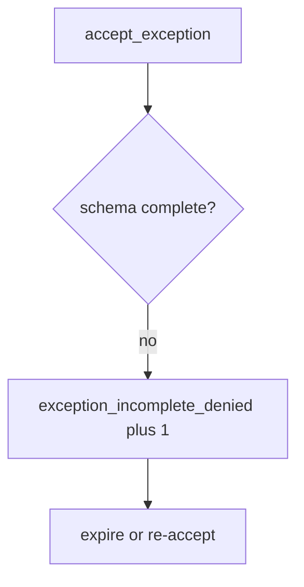

# E6-LO-06 — Detect exception_incomplete_denied without logging secrets

**Kind:** operations-exercise
**Loop step:** 6 Operate
**Standards:** NIST CSF 2.0 (final) DE/RS/RC as outcome labels. SAMM 2.0 as vocabulary.

## Prevention is not absolute

A new “fast-track risk” form can drop `review_by` after the schema was “set once.” Pair detect and recover. Do not log residual-risk writeups that contain secrets (3.1). Do not paste ePHI into the ticket.

## Mental model: incomplete row is a signal



| Outcome | This module |
|---|---|
| Detect | `exception_incomplete_denied` |
| Signal | missing fields, proposed owner; never secret writeups |
| Recover | Expire; fix or re-accept with fields |
| Residual | Unread register; tech-debt rename |

CSF 2.0 Detect / Respond / Recover name outcomes. They do not prove the schema. A maturity-model name is not the property. Re-run `test_exception_needs_owner_review_and_wcag` after any register-form change; a green “SAMM 2.5” tile is not that pytest. Expired `review_by` dates are the same family — inventory them before claiming Recover.

## Framework defaults versus the operate guarantee

A GRC dashboard will show exception counts and stay silent when CI’s `accept_exception` is always true. Detection must observe **empty owner is deny**, not “we have a risk register.” If the alert includes a secret writeup or ePHI, you have opened a 3.1 / 5.1 cell.

## Practice

Write one log line you would accept. Tie it to `labs/E6/e6-lab`.

```text
log_denied reason=exception_incomplete_denied missing=owner,review_by
```

Reject any line that includes a secret, a SAMM “Gate 7 complete,” or a CISA pledge screenshot.

## Transfer

Clinic: deny the HIPAA exception; do not paste ePHI into the ticket. Do not open a live GRC tenant.

## Usability

The exception must record whether patients can complete recovery (WCAG 2.2). The deny message must say *missing owner / review date / WCAG check*, not only “assert False” (Success Criterion 4.1.3).

Cause vs impact stays split here too: the **cause** is oral acceptance treated as a row; the **impact** is unowned residual and inaccessible recovery kept; **prevention** is the schema; **detection** is `exception_incomplete_denied`; **recovery** is expire-or-re-accept. Mechanism limit: this alert does not prove anyone reads the register and does not verify the WCAG flag.

## Non-goals

A maturity-model name is not the property. M2 stays not-attempted. CISA Secure by Design stays unverified.
