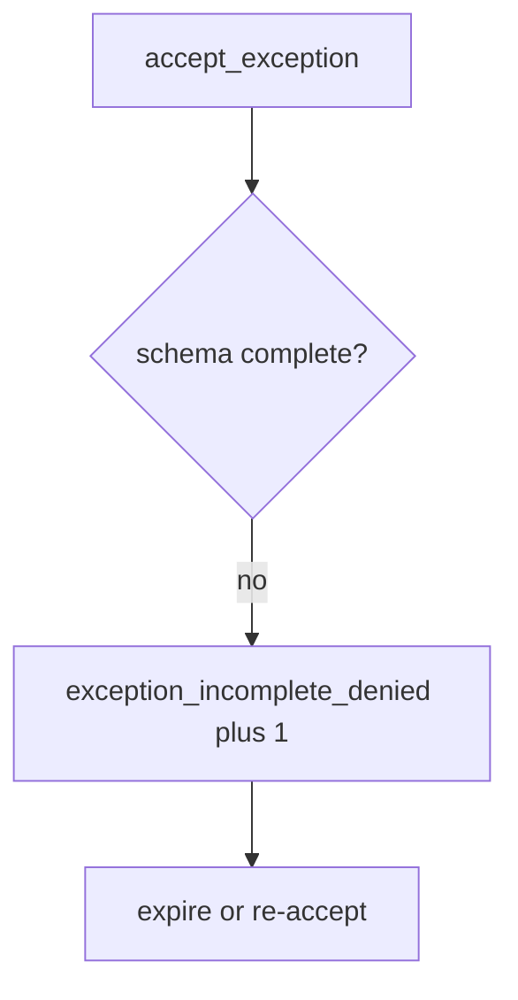

# Log the incomplete exception, not the secrets

**Kind:** operations-exercise
**Loop step:** 6 Operate

## Fixing it once is not enough

A new “fast-track risk” form can drop `review_by` after the schema was “set once.” Do not log leftover-risk writeups that contain secrets. Do not paste chart text into the ticket.

## Picture: incomplete row is a signal

An accept that skipped owner, review date, or accessibility still has to be noticed. Leave secrets out of the ticket. The notice should name the missing fields. Recovery should expire the hole or re-accept with a complete record.



A governance product is not the rule, and a schema screenshot is not proof.

Re-run `test_exception_needs_owner_review_and_wcag` after any register-form change. A green “maturity 2.5” tile is not that check. Expired `review_by` dates are the same family — inventory them before claiming recover.

## Signals that do not become a second leak

| Outcome | This topic |
|---|---|
| Notice | `exception_incomplete_denied` |
| What the line holds | Missing fields, proposed owner; **never** secret writeups |
| Respond | Stop the accept that ignored the schema; do not paste secrets into chat |
| Recover | Expire; fix or re-accept with fields |
| Leftover | Unread register; tech-debt rename |

A governance dashboard will show exception counts and stay silent when CI’s `accept_exception` is always true. Detection must observe **empty owner is deny**, not “we have a risk register.” If the alert includes a secret writeup or chart text, you have opened a leftover-secret leak.

```text
log_denied reason=exception_incomplete_denied missing=owner,review_by
```

Not: a secret, an “assurance gate complete,” or a pledge screenshot.

If your alert includes the matching writeup, you have copied the leak into the ticket.

## What the framework does vs what you still have to check

The same always-true accept, unread register, and tech-debt rename that bypass this practice will also bypass a “scan our risk dashboard” detector. A maturity-model name is not the rule.

Cause vs cost stays split here too: the **cause** is oral acceptance treated as a row; the **cost** is unowned leftover and inaccessible recovery kept; **how you stop it** is the schema; **how you notice** is `exception_incomplete_denied`; **how you recover** is expire-or-re-accept. What the tool cannot do: this alert does not prove anyone reads the register, and it does not verify the accessibility flag.

## Can people still use it

The exception must record whether people can complete recovery. The deny message must say *missing owner / review date / accessibility check*, not only “assert False.” Under stress, do not use color-only severity.

## Practice

```text
log_denied reason=exception_incomplete_denied missing=owner,review_by
```

Reject any line that includes a secret, an “assurance gate complete,” or a pledge screenshot.

## Use it somewhere new

A clinic example: deny the HIPAA exception; do not paste chart text into the ticket. Do not open a live governance tenant.

## What this page is not doing

A maturity-model name is not the rule. This page does not mark you as finished. An unverified pledge stays unverified. Answer keys are not on this site.
