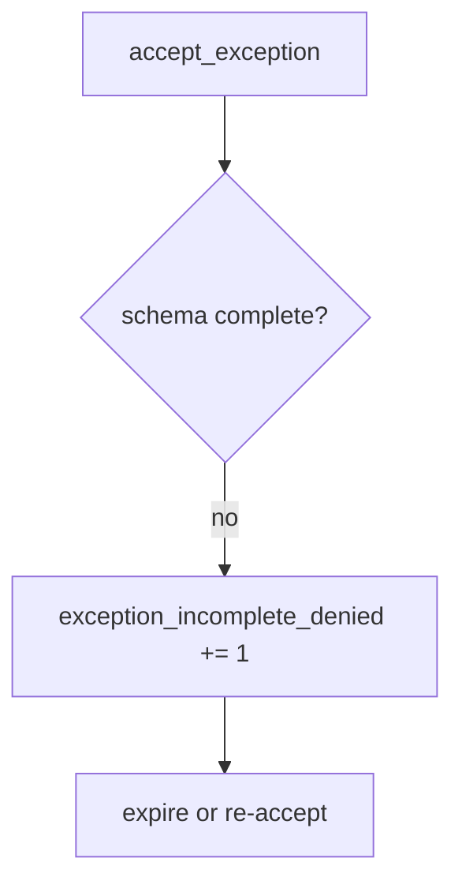

# E6-LO-06 — Detect exception_incomplete_denied without logging secrets

**Kind:** operations-exercise
**Loop step:** 6 Operate
**Standards:** NIST CSF 2.0 (final) DE/RS/RC as outcome labels.

## Prevention is not absolute

A new “fast-track risk” form can drop `review_by` after the schema was “set once.” Pair detect and recover. Do not log residual-risk writeups that contain secrets (3.1).

## Mental model: incomplete row is a signal



| Outcome | This module |
|---|---|
| Detect | `exception_incomplete_denied` |
| Signal | missing fields, proposed owner; never secret writeups |
| Recover | Expire; fix or re-accept with fields |
| Residual | Unread register; tech-debt rename |

## Practice

Write one log line you would accept. Tie it to `labs/E6/e6-lab`.

```
log_denied reason=exception_incomplete_denied missing=owner,review_by
```

Reject any line that includes a secret, a SAMM “Gate 7 complete,” or a CISA pledge screenshot.

## Transfer

Clinic: deny the HIPAA exception; do not paste ePHI into the ticket.

## Non-goals

A maturity-model name is not the property. M2 stays not-attempted.
