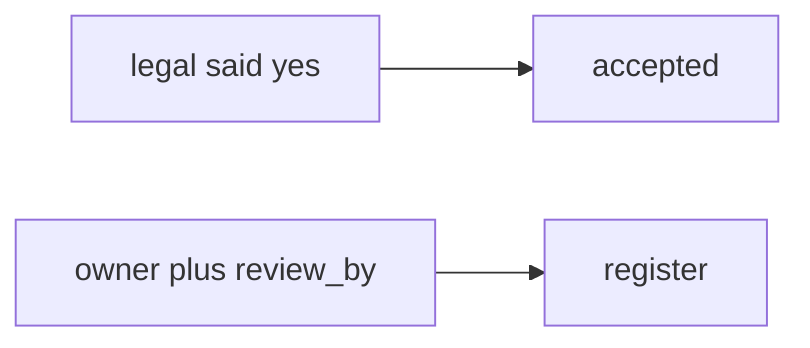

# E6-LO-07 — Transfer: clinic HIPAA exception

**Kind:** transfer-challenge
**Loop step:** 7 Transfer
**Standards:** SAMM 2.0 vocabulary. CSF 2.0 GV. CISA Secure by Design **unverified**.

## Change the workplace; keep the exception as a record

Do not answer with a Top 10 / CWE / scanner as the definition of security.

**Prompt:** Clinic “HIPAA exception.” Also name a procurement questionnaire vs this record.

**Product sketch:** EHR-lite “legal said we accept it,” plus “our SAMM score is 2.5 so exceptions are done.”

Rewrite the SecureCollab sentence. Include:

1. attacker capabilities (calendar / silent accept — not a live OCR audit);
2. trust assumptions (schema is TCB; SAMM/CSF/CISA pledge are not);
3. forbidden outcome (`accept_exception` true with empty owner, not “HIPAA”);
4. a test idea on a **local** fixture only (no clinic GRC tool);
5. residual (unread register, inaccessible recovery, `v5.0.0-15.1.5` Level 3);
6. WCAG (the exception must record whether patients can complete recovery).

## Mental model: legal said vs dated owner

## What graders reject

| Reject | Why |
|---|---|
| “SAMM / HIPAA / CISA pledge” | Not the row |
| Live clinic GRC / OCR | Lab policy |
| “exceptions are failure so we hide them” | Dishonest register |

## Practice

One page. No keys. `labs/E6/e6-lab` is the only running system you may break.
