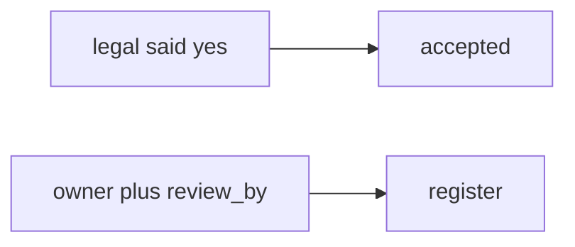

# Somewhere new: clinic HIPAA exception

**Kind:** transfer-challenge
**Loop step:** 7 Transfer

## Use it somewhere new

The notes-app scaffolding goes away. You get a **clinic that files a “HIPAA exception.”** Your job is to rewrite the loop, not to name a bug-list code.

The notes-app sentence was: `accept_exception({"owner": "", "review_by": None})` must be false. Rewrite it for a clinic without changing the fork: empty owner denied, complete record may accept. “Legal said we accept it” is still a spoken yes, not a register row.

**Product sketch:** an EHR-lite “legal said we accept it,” plus “our maturity score is 2.5 so exceptions are done.”

## Picture: same accept loop, clinical object

Renaming “note” to “chart” is not transfer. Owner, review date, and accessibility flag still have to be on the row. Filing a HIPAA slide and marking the hole Accepted does not set `owner` or `review_by`.

| Notes app this week | Clinic sketch |
|---|---|
| Exception dict with owner + review_by + wcag_checked | Clinic exception with the same three fields |
| Schema before accept | Same schema on a **local** practice files |
| `accept_exception({"owner": "", "review_by": None})` | Same call — empty owner still denied |
| Calendar / silent accept | Same pressure — **not** a live clinic audit |
| Maturity score / pledge / HIPAA slide | Same inputs — not the accept decision |
| Procurement questionnaire vs this record | A different document — name it, do not open a live audit |

If legal said yes while `accept_exception` is always true, the rule is gone. A maturity score, an industry “govern” sticker, and an unverified pledge do not put `owner` and `review_by` on the row. A procurement questionnaire is a different document — name it, do not open a live clinic audit here. Exceptions are not failure; hiding them is a dishonest register. A later design-review draft stays a draft. Extra advanced documentation of a dangerous function is documentation, not this check.

The clinic rewrite still has to keep the notes-app fork: empty owner denied, complete record may accept. Adding a HIPAA slide without the schema leaves `accept_exception` true on empty owner. The local pytest analogue is `test_exception_needs_owner_review_and_wcag` — on a practice, not a live governance tool.

## Prompt — clinic HIPAA exception

Rewrite the notes-app sentence. Include:

1. who can act (calendar / silent accept — not a live clinic audit);
2. what you trust (schema is the promise; maturity score, industry labels, and a pledge are not);
3. what must not happen (`accept_exception` true with empty owner, not a legal label);
4. a test idea on a **local** practice files only (no clinic governance tool);
5. leftover (unread register, inaccessible recovery, extra advanced documentation);
6. whether the exception records that patients can complete recovery (plain language, not color-only).

Use fake labels. Do not use real patient names.

Also name a procurement questionnaire vs this record.

## What is not good enough

| Reject | Why |
|---|---|
| “maturity / HIPAA / pledge” | Not the row |
| Live clinic governance / live audit | Course rules |
| “exceptions are failure so we hide them” | Dishonest register |
| “later design-review draft certified” | Still a draft |
| “assurance gate complete” | Forbidden stamp |

## Practice

One page. No answer keys. `labs/E6/e6-lab` is the only running system you may break. Do not contact a live disclosure inbox.

## What this page is not doing

Live-disclosure. Production exceptions. Real patient charts in tickets. Claiming you finished an assurance gate from this page.
