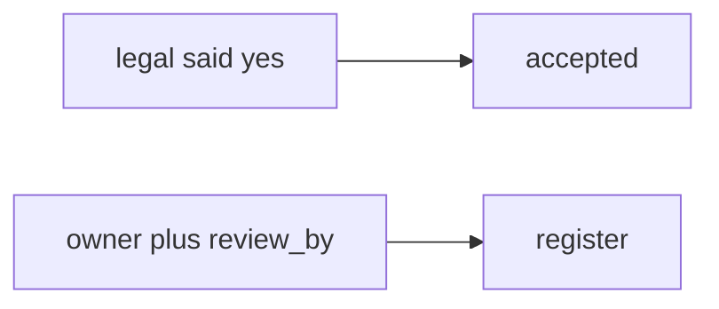

# E6-LO-07 — Transfer: clinic HIPAA exception

**Kind:** transfer-challenge
**Loop step:** 7 Transfer
**Standards:** SAMM 2.0 vocabulary. CSF 2.0 GV. CISA Secure by Design **unverified**. SSDF 1.2 **draft**. `v5.0.0-15.1.5` Level 3 **advanced**.

## Change the workplace; keep the exception as a record

Do not answer with a Top 10 / CWE / scanner as the definition of security. The SecureCollab sentence was: `accept_exception({"owner": "", "review_by": None})` must be false. Rewrite it for a clinic without changing the fork.

**Prompt:** Clinic “HIPAA exception.” Also name a procurement questionnaire vs this record.

**Product sketch:** EHR-lite “legal said we accept it,” plus “our SAMM score is 2.5 so exceptions are done.”

Rewrite the SecureCollab sentence. Include:

1. attacker capabilities (calendar / silent accept — not a live OCR audit);
2. trust assumptions (schema is TCB; SAMM/CSF/CISA pledge are not);
3. forbidden outcome (`accept_exception` true with empty owner, not “HIPAA”);
4. a test idea on a **local** fixture only (no clinic GRC tool);
5. residual (unread register, inaccessible recovery, `v5.0.0-15.1.5` Level 3);
6. WCAG (the exception must record whether patients can complete recovery).

## Mental model: legal said vs dated owner

If legal said yes while `accept_exception` is always true, the cell is gone. A SAMM score, a CSF GV sticker, and a CISA pledge do not put `owner` and `review_by` on the row. A procurement questionnaire is a different document — name it, do not open a live OCR audit here. Exceptions are not failure; hiding them is a dishonest register. SSDF 1.2 IPD stays draft. `v5.0.0-15.1.5` is Level 3 advanced: document dangerous functionality, not this pytest.

The clinic rewrite still has to keep the SecureCollab fork: empty owner denied, complete record may accept. Adding a HIPAA slide without the schema leaves `accept_exception` true on empty owner. The local pytest analogue is `test_exception_needs_owner_review_and_wcag` — on a fixture, not a live GRC tool.

## What graders reject

| Reject | Why |
|---|---|
| “SAMM / HIPAA / CISA pledge” | Not the row |
| Live clinic GRC / OCR | Lab policy |
| “exceptions are failure so we hide them” | Dishonest register |
| “SSDF 1.2 certified” | IPD draft |
| “Gate 7 complete” | Forbidden stamp |

## Practice

One page. No keys. `labs/E6/e6-lab` is the only running system you may break. Do not contact a live PSIRT.

## Non-goals

Live-disclosure. Production exceptions. Claiming Gate 7 or M2 from this page.
