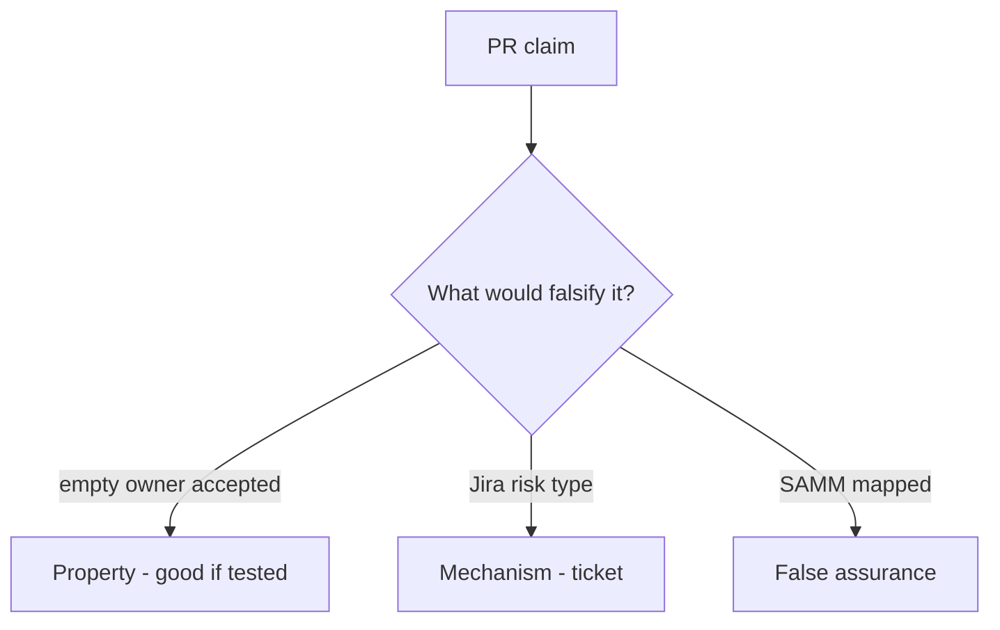

# E6-LO-08 — Review always-accept exception as a PR

**Kind:** code-review
**Loop step:** Review
**Standards:** SAMM 2.0 vocabulary. ASVS `v5.0.0-15.1.5` Level 3 advanced.

## Review the fixture as if it were SecureCollab’s risk register

Review `labs/E6/e6-lab/vulnerable/` as a SecureCollab PR. Intended findings live only in `content/assessment/keys/E6.md` — not here.

## Mental model: Accept with empty owner

Start with this seeded smell: **Accept with empty owner**. Label it property, mechanism, or false assurance before you accept the PR.

Seeded smells (label them yourself; do not open the keys file):

- Accept with empty owner
- No `review_by`
- Accessibility not in the schema
- SAMM slide as the exception

Also reject: live PSIRT, keys in lessons, claiming Gate 7.

## Misconceptions

- Leadership is soft skills not invariants
- Exceptions are failure
- Users can always call support instead of accessible recovery

## Practice

Write three review notes. Tie at least one to `test_exception_needs_owner_review_and_wcag`.

## Transfer

Clinic PR that “added a HIPAA slide and a SAMM score” without owner/review/WCAG is incomplete.
