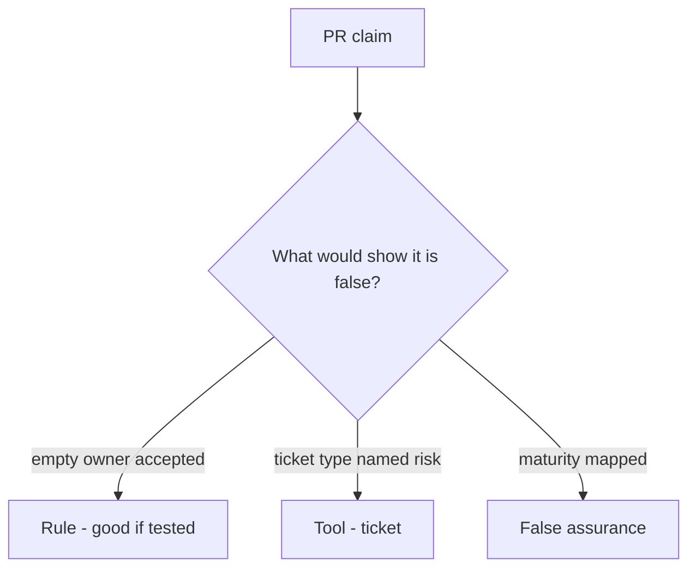

# Would you merge this always-accept exception?

**Kind:** code-review
**Loop step:** Review

The answers are not on this page. Do not open the keys file until someone has looked at your review.

## What you are reviewing

A colleague ships the notes app’s leftover-risk register. Review `labs/E6/e6-lab/vulnerable/` as that change. Check whether `accept_exception({"owner": "", "review_by": None})` still returns true, compare that with the rule, and write changes a developer can verify.

Start at `accept_exception` and the empty-owner row, not at a scanner color or a maturity screenshot. The check you already ran (`test_exception_needs_owner_review_and_wcag`) is the rule test. A comment “will add dates later” is not.

## Picture: accept with empty owner

**Accept with empty owner**. Label it rule, tool, or false assurance before you accept the change.

What has to stay true: empty owner denied. If that call never includes the schema, that always-accept leftover is still open. A maturity screenshot does not replace that check.

Unread register is leftover. Tech-debt rename is leftover. Do not skip `test_exception_needs_owner_review_and_wcag`. This page does not mark you as finished. Do not contact a live disclosure inbox to prove the finding.

## Problems to find (name them yourself)

- Accept with empty owner
- No `review_by`
- Accessibility not in the schema
- Maturity slide as the exception

Also reject: live disclosure; shipping without re-running `test_exception_needs_owner_review_and_wcag`; keys in learner notes; claiming an assurance gate; treating an unverified pledge as proven.

## Common mix-ups

- Leadership is soft skills, not rules
- Exceptions are failure
- People can always call support instead of accessible recovery
- A maturity score is the register
- A HIPAA slide is `accept_exception`

## Practice

Write three review notes a maintainer could act on. Each note: what you saw, rule or false assurance, suggested structural change, leftover you will **not** delete. Tie at least one note to `test_exception_needs_owner_review_and_wcag`. Do not open the keys file.

## Use it somewhere new

Clinic change that “added a HIPAA slide and a maturity score” without owner / review / accessibility is an incomplete register review. Name the independent falsehood that would still keep empty owner from accepting.

## Can people still use it

A deny notice must say why the exception stayed incomplete (missing owner, review date, or accessibility check), not only “will add dates later.”

## What this page is not doing

Do not merge by adding a comment “will add dates later.” That comment is leftover without an owner. Do not email a vendor disclosure inbox to prove the finding.
