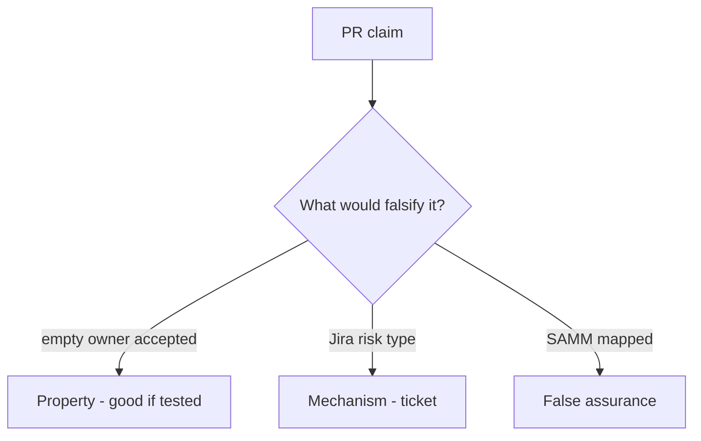

# E6-LO-08 — Review always-accept exception as a PR

**Kind:** code-review
**Loop step:** Review
**Standards:** SAMM 2.0 vocabulary. ASVS `v5.0.0-15.1.5` Level 3 advanced. CISA Secure by Design **unverified**.

## Review the fixture as if it were SecureCollab’s risk register

Review `labs/E6/e6-lab/vulnerable/` as a SecureCollab PR. Your job is not to count suspicious lines. Reconstruct whether `accept_exception({"owner": "", "review_by": None})` still returns true, compare that with the module invariant, and write changes a developer can verify.

Intended findings live only in `content/assessment/keys/E6.md` — not here. Do not open the keys file until your review has been evaluated.

## Mental model: Accept with empty owner

Start with this seeded smell: **Accept with empty owner**. Label it property, mechanism, or false assurance before you accept the PR.

Classification starts at the protected effect (empty owner denied). Everything that is not the schema at that call is a candidate always-accept path. A SAMM screenshot without that pytest is the same smell, not a different finding class.

Unread register is residual. Tech-debt rename is residual. Do not skip `test_exception_needs_owner_review_and_wcag`. Do not claim Gate 7. Do not contact a live PSIRT to prove the finding.

## Seeded smells (label them yourself)

- Accept with empty owner
- No `review_by`
- Accessibility not in the schema
- SAMM slide as the exception

Also reject: live PSIRT; shipping without re-running `test_exception_needs_owner_review_and_wcag`; keys in lessons; claiming Gate 7; treating CISA Secure by Design as verified.

## Misconceptions this module refuses

- Leadership is soft skills not invariants
- Exceptions are failure
- Users can always call support instead of accessible recovery
- SAMM score is the register
- A HIPAA slide is `accept_exception`

## Practice

Write three review notes a maintainer could act on. Each note: observation, property or false assurance, suggested structural change, residual you will **not** delete. Tie at least one to `test_exception_needs_owner_review_and_wcag`.

## Transfer

Clinic PR that “added a HIPAA slide and a SAMM score” without owner/review/WCAG is an incomplete register review. Name the independent falsehood that would still keep empty owner from accepting.

## Non-goals

Do not merge by adding a comment “will add dates later.” That comment is a residual without an owner. Do not email a vendor PSIRT to prove the finding.
