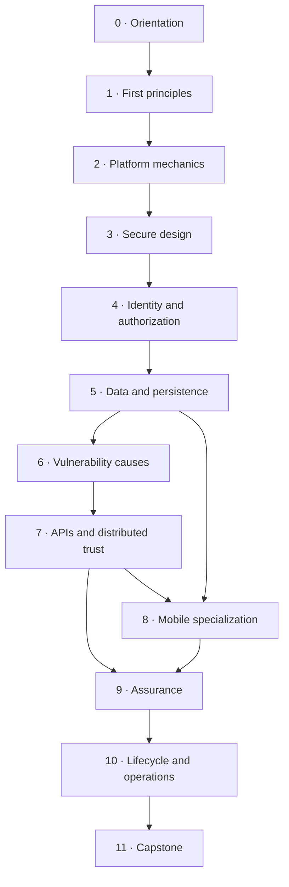

# Secure Application Engineering from First Principles

**Curriculum Blueprint — Web, API, and Mobile Applications**

**Status:** Curriculum architecture only; lesson content has intentionally not been generated  
**Blueprint revision:** 1.1  
**Research snapshot:** 23 August 2026  
**Audience:** An experienced Python/backend developer becoming a security-minded application engineer  
**Recommended implementation track:** Python/FastAPI + PostgreSQL for the backend, TypeScript/React or Next.js for the browser client, and one mobile implementation track chosen before content production (Android/Kotlin, iOS/Swift, or React Native with native-security exercises)  
**Core structure:** 50 modules, 11 mastery gates, 6 staged releases, 1 integrating capstone, and 6 electives  
**Estimated core effort:** 310–380 focused hours, normally 9–12 months part-time; the sequence is competency-based rather than calendar-bound  

---

## 1. What this document is—and is not

This is the complete curriculum map for learning to **design, build, verify, deploy, and operate secure applications**. It defines the order of learning, prerequisite graph, module outcomes, hands-on evidence, mastery gates, capstone, standards mappings, and the content model for the future Vercel learning website.

It deliberately does **not** contain:

- lesson prose or tutorials;
- exploit payloads or attack walkthroughs;
- code samples or completed implementations;
- quizzes, question banks, or answer keys;
- vendor-specific setup instructions;
- the website implementation.

Those will be generated in later passes, after this blueprint is accepted.

## 2. Curriculum thesis

Security is not a bag of headers, scanners, or vulnerability names. A system is secure only relative to:

1. something of value;
2. an explicit set of allowed and forbidden outcomes;
3. an attacker with stated capabilities;
4. a time horizon and operating environment; and
5. evidence that the required properties continue to hold when the system is misused, partially fails, or is attacked.

The course therefore treats application security as **maintaining invariants under adversarial conditions**. Every control must be derived from a threat and a required property. Every claimed property must have evidence. Every preventive control must be paired, where appropriate, with detection and recovery.

The path is **builder-first and spiral, not waterfall**. The learner ships increasingly complete vertical slices, then revisits earlier models when identity, persistence, mobile, deployment, or operating assumptions change. Offensive techniques are included only to expose causes, validate impact, and verify repairs; they do not become the organizing goal.

The sequence is intentionally not organized around a rotating “Top 10.” OWASP itself describes its Top 10 as an awareness document; the current web release is [OWASP Top 10:2025](https://owasp.org/Top10/2025/). The verification backbone is the stable [OWASP ASVS 5.0.0](https://owasp.org/www-project-application-security-verification-standard/) for web/API systems and [OWASP MASVS 2.1.0](https://mas.owasp.org/news/2024/01/18/masvs-v210-release--masvs-privacy/) plus [MASTG 2.0.0](https://mas.owasp.org/news/archive/2026/) for mobile systems.

## 3. The first-principles learning loop

Every substantive module will follow the same seven-step loop. This becomes the template for content generation later.

| Step | Learner action | Required output |
|---|---|---|
| 1. Property | State what must remain true | A precise security invariant |
| 2. Model | Identify assets, actors, authority, boundaries, state, and time | A small system/threat model |
| 3. Break | Observe or reproduce the smallest representative failure in an authorized lab | Evidence of cause and impact |
| 4. Build | Apply the smallest trustworthy mechanism that restores the invariant | A secure implementation or design change |
| 5. Verify | Prove normal, negative, abuse, and failure cases | Tests and review evidence |
| 6. Operate | Decide what must be logged, alerted, rotated, revoked, or recovered | Detection/recovery notes or runbook |
| 7. Generalize | Explain when the control works, when it does not, and its trade-offs | Transfer exercise and standards mapping |

This loop prevents three common failures in security education: memorizing symptoms without causes, learning offensive tricks without learning design, and trusting controls without verifying their assumptions.

## 4. Timeless principles that organize the course

The intellectual spine comes from Saltzer and Schroeder’s classic [Protection of Information in Computer Systems](https://web.mit.edu/saltzer/www/publications/protection/), extended for distributed, cloud, browser, mobile, and human systems.

| Principle | Curriculum interpretation |
|---|---|
| Economy of mechanism | Prefer small, understandable security-critical mechanisms and minimize the trusted computing base. |
| Fail-safe defaults | Deny unless authority is positively established; choose secure initial and failure states. |
| Complete mediation | Check every security-relevant access, including indirect, cached, bulk, background, and retry paths. |
| Open design | Assume design and code can become known; do not depend on secrecy of mechanism. |
| Separation of privilege | Require independent conditions for high-impact operations and isolate administrative power. |
| Least privilege | Minimize authority by subject, resource, operation, environment, and time. |
| Least common mechanism | Reduce shared state and shared mechanisms that can become cross-user or cross-tenant channels. |
| Psychological acceptability | Make the secure action understandable and easier than bypassing the control. |
| Work factor | Match defensive cost to plausible attacker resources, asset value, and attack economics. |
| Compromise recording | Design useful, tamper-resistant evidence and detection where prevention cannot be absolute. |

Modern additions used throughout the curriculum are: minimize attack surface; isolate blast radius; distrust all externally controlled data and clients; make state transitions explicit; make operations idempotent where needed; bind messages to context; design for revocation and recovery; minimize retained data; make secure behavior usable and accessible; and treat dependencies, build systems, configuration, data stores, and operators as part of the product’s attack surface.

## 5. Target graduate profile

On completion, the learner should be able to:

1. turn product behavior into assets, invariants, abuse cases, and testable security requirements;
2. draw trust boundaries and data flows for browser, API, mobile, worker, database, third-party, and cloud components;
3. design authentication, session, delegation, account recovery, and authorization systems without conflating them;
4. implement secure defaults for data handling, databases and persistence, cryptography, secrets, file processing, browser behavior, APIs, mobile platforms, and distributed workflows;
5. explain common vulnerability families from parser, authority, state, trust, and resource-accounting failures rather than by name alone;
6. perform secure code review and create negative, property-based, fuzz, integration, authorization, and abuse tests;
7. select and interpret SAST, DAST, SCA, secret, IaC, container, and runtime signals without mistaking tools for assurance;
8. create a traceable evidence pack against a tailored ASVS/MASVS baseline;
9. secure source control, CI/CD, dependencies, artifacts, configuration, cloud/runtime identities, and release provenance;
10. build privacy-aware logging, detection, incident response, recovery, disclosure, and end-of-life plans;
11. design security-sensitive user journeys that remain understandable, accessible, and resistant to unsafe workarounds; and
12. communicate residual risk and trade-offs honestly to developers, product owners, and non-security stakeholders.

## 6. Entry profile and adaptive bridge

The main path assumes the learner can already build a small database-backed API, use Git, write tests, and understand basic SQL. A diagnostic—not a blanket prerequisite course—determines which bridge units are needed.

| Bridge area | Exit evidence |
|---|---|
| Python application engineering | Typed service with tests, dependency management, structured errors, and configuration separated from code |
| JavaScript/TypeScript and browser tools | Small browser client; ability to inspect requests, cookies, storage, DOM, source maps, and security headers |
| SQL and data modeling | Transactions, constraints, indexes, isolation concepts, parameterized queries, and migration discipline |
| Linux/process/network basics | Processes, users, permissions, sockets, DNS lookup, TLS inspection, environment variables, and logs |
| Git and CI basics | Branch/PR workflow, protected changes, reproducible test command, and minimal CI workflow |
| Mobile development, if selected | A minimal signed app, simulator/device debugging, platform permission use, and API communication |

The diagnostic result will create an individualized prerequisite list on the future website. It will not block progress on already-mastered material.

---

## 7. Curriculum map

### Core dependency graph

The arrows show hard sequencing dependencies, not a one-time handoff. Every staged release revisits earlier invariants, threat models, tests, and operational assumptions. Phase 8 can be postponed for a web/API-only milestone; electives open after Phase 7 and require the relevant core foundations.



### Phase 0 — Orientation, ethics, and the laboratory

**Purpose:** Establish legal/ethical boundaries, a repeatable lab, and a baseline of present skill. Offensive exercises are restricted to deliberately vulnerable or explicitly authorized targets.

| ID | Module | Required mastery | Evidence produced | Standards anchors |
|---|---|---|---|---|
| 0.1 | Security engineering orientation | Distinguish vulnerability, threat, risk, control, assurance, compliance, privacy, safety, and resilience. Define authorization boundaries for testing. | Personal lab rules, scope template, and initial security vocabulary map | NIST CSF 2.0; NICE Framework; OWASP WSTG |
| 0.2 | Diagnostic and adaptive bridge | Demonstrate the minimum web/backend/tooling skills and select only the missing bridge units. | Diagnostic repository and individualized path | NICE Secure Systems Development competencies |

**Gate 0:** The learner can safely capture and replay traffic against a local lab, run tests, explain the authorized scope, and identify prerequisite gaps.

### Phase 1 — Security from first principles

**Purpose:** Build the mental models that remain useful after individual technologies and vulnerability lists change.

| ID | Module | Required mastery | Evidence produced | Standards anchors |
|---|---|---|---|---|
| 1.1 | Security as invariants under attack | Express confidentiality, integrity, availability, authenticity, authorization, accountability, privacy, and safety as system-specific invariants. Separate desired property from mechanism. | Invariant catalogue for the reference application | Saltzer–Schroeder; NIST CSF 2.0 |
| 1.2 | Authority and protection | Model subjects, objects, actions, delegation, capabilities, ambient authority, and access matrices. Apply least privilege, complete mediation, fail-safe defaults, separation of privilege, and secure defaults. | Authority map and access matrix | Saltzer–Schroeder; CISA Secure by Design; ASVS V8/V15 |
| 1.3 | Trust boundaries and attack surface | Identify the trusted computing base, entry points, transitive trust, shared mechanisms, isolation boundaries, and blast radius. Explain defense in depth without assuming every layer is independent. | Annotated trust-boundary diagram and attack-surface inventory | OWASP Threat Modeling; ASVS V15 |
| 1.4 | Risk, people, economics, usable security, and resilience | Model threat actors by capability and incentive; reason about human error, coercion, accessibility, security friction, abuse economics, work factor, graceful degradation, detection, and recovery. | Risk register with assumptions, uncertainty, user-harm scenarios, and residual risk | CISA Secure by Design; NIST CSF 2.0; NIST SP 800-63-4; WCAG 2.2; OWASP SAMM |

**Gate 1:** Given an unfamiliar product description, the learner can define security without naming a particular tool or vulnerability and can justify which outcomes matter most.

### Phase 2 — The mechanics beneath web security

**Purpose:** Understand the platforms well enough to predict failure instead of memorizing mitigations.

| ID | Module | Required mastery | Evidence produced | Standards anchors |
|---|---|---|---|---|
| 2.1 | Bytes, text, formats, parsers, and interpreters | Reason about bytes versus characters, Unicode, normalization, canonicalization, encodings, grammars, serialization, parser differentials, and interpreter boundaries. | Parser-boundary map and ambiguity test suite | ASVS V1/V2/V15; CWE |
| 2.2 | DNS, transport, HTTP, TLS, proxies, CDNs, and caches | Trace a request end to end; identify where identity, scheme, host, headers, body, and cache keys can be transformed or trusted incorrectly. Understand current TLS 1.3 deployment responsibilities. | Request-path diagram and hardened local edge configuration | ASVS V4/V12/V13; current TLS 1.3 [RFC 9846](https://datatracker.ietf.org/doc/html/rfc9846) |
| 2.3 | Browser security model | Explain origin versus site, navigation, DOM authority, cookies, storage, frames, CORS, Fetch metadata, CSP, Trusted Types, Subresource Integrity, third-party resources, cross-origin isolation, and browser-enforced versus server-enforced controls. | Browser policy matrix and header/cookie verification tests | ASVS V3; [CSP Level 3](https://www.w3.org/TR/CSP3/); [Trusted Types](https://www.w3.org/TR/trusted-types/) |
| 2.4 | State, time, concurrency, and distributed failure | Model session state, replay, freshness, idempotency, ordering, retry, timeout, clock assumptions, locks, transactions, TOCTOU, race conditions, and partial failure. | State-machine model plus concurrency and replay tests | ASVS V2/V7/V9/V16; OWASP Top 10:2025 A10 |

**Gate 2:** The learner can trace security-relevant state across browser, edge, application, database, queue, and third-party boundaries and predict where two components may interpret the same message differently.

### Phase 3 — Design before code

**Purpose:** Convert product intent into explicit security decisions before vulnerabilities are embedded in architecture.

| ID | Module | Required mastery | Evidence produced | Standards anchors |
|---|---|---|---|---|
| 3.1 | Assets, data classification, and security requirements | Identify asset owners, sensitivity, lifecycle, regulatory context, unacceptable outcomes, and measurable requirements. Tailor rather than blindly copy a checklist. | Data inventory, classification scheme, and security requirements backlog | ASVS 5.0; MASVS 2.1; NIST SSDF 1.1 |
| 3.2 | Threat modeling | Decompose a system with data-flow diagrams; identify threats with abuse cases, attack trees, and a method such as STRIDE; use LINDDUN where privacy analysis adds value; prioritize and validate mitigations; define change triggers for revisiting the model. | Version-controlled threat model with open assumptions, owners, review triggers, and decision history | OWASP Threat Modeling; NIST SP 800-154 as informative draft |
| 3.3 | Secure architecture patterns | Apply compartmentalization, centralized policy with local enforcement, administrative-plane isolation, safe intermediaries, secure defaults, tenant boundaries, egress control, and narrow interfaces. Analyze monolith, microservice, and serverless trade-offs without assuming one is inherently secure. | Architecture decision records with rejected alternatives | ASVS V15; CISA Secure by Design; NIST SSDF |
| 3.4 | Business logic and abuse-resistant design | Model valid state transitions, invariants, high-impact workflows, automation, quotas, rate limits, fraud/abuse signals, human confirmation, and cost exposure. | Misuse-case set, workflow state machine, and abuse-control plan | ASVS V2; OWASP API Top 10:2023 API4/API6 |

**Gate 3:** The learner can produce a reviewable threat model and turn its highest-priority threats into acceptance criteria, tests, design decisions, and operational signals.

### Phase 4 — Identity, authentication, sessions, and authorization

**Purpose:** Treat identity as a lifecycle and authorization as a continuously enforced relationship—not as a login screen.

| ID | Module | Required mastery | Evidence produced | Standards anchors |
|---|---|---|---|---|
| 4.1 | Digital identity and account lifecycle | Separate identifiers, identity proofing, enrollment, authenticators, authentication, federation, and authorization. Design account states, enrollment, change, suspension, deletion, recovery, notifications, and support/admin workflows, including safe verification and anti-impersonation controls. | Account-lifecycle state machine, recovery threat model, and support-workflow control matrix | [NIST SP 800-63-4](https://pages.nist.gov/800-63-4/); ASVS V6 |
| 4.2 | Authentication, phishing resistance, and usable access | Design passwords with modern storage and throttling, MFA, passkeys/WebAuthn, step-up and transaction reauthentication. Address enumeration, credential stuffing, factor replacement, recovery, accessibility, and user friction as security outcomes rather than UI afterthoughts. | Authenticator decision record, accessible-flow review, and negative test suite | NIST SP 800-63B-4; ASVS V6; WCAG 2.2; WebAuthn Level 3 Candidate Recommendation |
| 4.3 | Sessions, cookies, and tokens | Compare server-side sessions, opaque tokens, and self-contained tokens; design creation, binding, storage, rotation, expiry, revocation, logout, concurrent-device behavior, and theft response. Avoid treating JWT as an authentication architecture. | Session protocol/state diagram and theft/replay/revocation tests | ASVS V3/V7/V9; OWASP Session Management guidance |
| 4.4 | Authorization and tenant isolation | Implement deny-by-default, object/function/property checks, policy composition, and authorization for every path. Compare RBAC, ABAC, ReBAC, and capabilities; enforce multi-tenant isolation in services, queries, background jobs, storage, caches, and administration. | Executable authorization matrix and cross-tenant regression suite | ASVS V8; OWASP API1/API3/API5; Saltzer complete mediation |
| 4.5 | OAuth, OpenID Connect, browser apps, and native apps | Distinguish delegation from authentication; select authorization-code flows, PKCE, redirect handling, state/nonce, sender constraints where applicable, token audience, consent, account linking, and logout. Compare browser-only, backend-for-frontend, and native-client threat models. | Protocol sequence diagrams and malicious-client/redirect tests | ASVS V10; [RFC 9700](https://datatracker.ietf.org/doc/html/rfc9700); [RFC 10017](https://datatracker.ietf.org/doc/rfc10017/); [RFC 8252](https://datatracker.ietf.org/doc/rfc8252/) |

**Gate 4:** The learner can defend an identity architecture review, demonstrate account-recovery and token-theft handling, and prove that a user cannot cross role, object, function, property, or tenant boundaries.

### Phase 5 — Data protection, persistence, cryptography, secrets, and privacy

**Purpose:** Derive data and persistence controls from lifecycle and threat, use established cryptographic constructions correctly, and reduce the amount of data that needs protection.

| ID | Module | Required mastery | Evidence produced | Standards anchors |
|---|---|---|---|---|
| 5.1 | Data lifecycle and privacy engineering | Inventory collection, use, sharing, retention, backups, logs, analytics, export, correction, deletion, and disposal. Apply minimization, purpose limitation, user transparency/control, and privacy threat modeling. | Data-flow inventory, retention/deletion matrix, and privacy review | ASVS V14; MASVS-PRIVACY; NIST Privacy Framework 1.0 (1.1 remains draft); India DPDP Act/Rules awareness |
| 5.2 | Cryptographic properties and safe use | Select hashes, MACs, signatures, password KDFs, key derivation, AEAD, randomness, and nonces by required property and threat. Recognize misuse, downgrade, oracle, replay, and home-grown-crypto risks. | Crypto decision table and misuse-focused tests | ASVS V11; [RFC 9106](https://datatracker.ietf.org/doc/html/rfc9106); OWASP Cryptographic Storage guidance |
| 5.3 | Key and secret lifecycle | Design generation, storage, distribution, access, audit, rotation, versioning, revocation, compromise recovery, and destruction. Apply envelope encryption, maintain cryptographic inventory/agility, plan rather than improvise post-quantum transitions, and distinguish application secrets from user passwords and public identifiers. | Key hierarchy, secret inventory, rotation exercise, and compromise runbook | ASVS V11/V13; OWASP Key and Secrets Management guidance; NIST PQC standards |
| 5.4 | Secure communication and channel binding | Configure authenticated encryption in transit, certificate/hostname validation, HSTS, service identity, mTLS where justified, and end-to-end protection where transport termination is insufficient. Evaluate certificate pinning as a risk trade-off, not a universal rule. | Trust-chain diagram, TLS tests, and certificate failure drill | ASVS V12; RFC 9846; MASVS-NETWORK |
| 5.5 | Database and persistence security | Preserve invariants with schema constraints, transactions, isolation, least-privileged database roles, restricted network exposure, safe connection handling, and auditable administrative access. Evaluate row-level security as an additional enforcement layer—not a substitute for application authorization—and protect migrations, replicas, search/index stores, analytics paths, backups, restores, and deletion behavior. | Threat-modeled schema, role/grant matrix, constraint and cross-tenant tests, migration review, and verified backup/restore exercise | ASVS V2/V8/V13/V14/V16; OWASP Database Security guidance; PostgreSQL row-security documentation |

**Gate 5:** The learner can justify every retained sensitive field, data-store privilege, schema invariant, cryptographic primitive, key location, trust anchor, backup, and deletion limitation—and can demonstrate constraint enforcement, restore, rotation, and compromise recovery rather than only encryption success.

### Phase 6 — Vulnerability families rebuilt from their root causes

**Purpose:** Learn to predict and eliminate vulnerability classes by understanding which security invariant, interpreter boundary, context, authority check, or resource assumption failed. Each module uses an authorized break–fix–verify loop.

| ID | Module | Required mastery | Evidence produced | Standards anchors |
|---|---|---|---|---|
| 6.1 | Interpreter confusion and injection | Trace untrusted data into SQL, NoSQL, OS commands, templates, expressions, LDAP, mail headers, and other interpreters. Prefer structural APIs and parameterization; place validation, canonicalization, sanitization, and encoding in their correct roles. | Multi-interpreter data-flow review and exploit/fix regression set | ASVS V1/V2; OWASP Top 10:2025 A05; CWE-77/78/89 |
| 6.2 | Browser injection and active content | Analyze reflected, stored, and DOM XSS, unsafe sinks, HTML/URL/JavaScript/CSS contexts, DOM clobbering, and prototype pollution. Combine context-aware output handling with framework safety, CSP, and Trusted Types as layered controls. | Browser exploit/fix lab plus CSP/Trusted Types rollout plan | ASVS V1/V3; CWE-79; W3C CSP/Trusted Types |
| 6.3 | Cross-site and cross-context attacks | Reason about CSRF, clickjacking, CORS misconfiguration, `postMessage`, opener/frame relationships, cross-origin leaks, cookie semantics, and navigation-based attacks from the browser’s authority model. | Cross-origin policy matrix and attack/defense tests | ASVS V3/V7; W3C/WHATWG browser security model |
| 6.4 | Files, paths, uploads, archives, XML, and deserialization | Secure filenames, storage locations, media validation, size/complexity, decompression, parsing, transformation, download disposition, and indirect processing. Prevent path traversal, unsafe deserialization, entity expansion, and execution through uploaded content. | Hostile-file corpus and isolated processing design | ASVS V1/V5; CWE-22/434/502 |
| 6.5 | Server-side requests and protocol parsing | Handle URLs as structured untrusted input; restrict schemes, resolution, destinations, redirects, DNS rebinding exposure, and egress. Understand SSRF, open redirect, host/header trust, request desynchronization, and cache-key confusion as parser/trust-boundary failures. | Egress policy, URL validation tests, and edge-origin consistency tests | ASVS V4/V13/V15; OWASP API7; OWASP Top 10:2025 A01/A02 |
| 6.6 | Workflow, race, and exceptional-condition failures | Find state-machine bypasses, duplicate execution, TOCTOU, concurrency limits, ordering bugs, stale authorization, fail-open handling, unsafe retries, partial commits, and information-rich errors. | Concurrency/chaos test suite and repaired workflow state machine | ASVS V2/V16; OWASP Top 10:2025 A10 |
| 6.7 | Resource abuse, automation, and availability | Bound CPU, memory, storage, bandwidth, fan-out, query complexity, pagination, upload, notification, and paid third-party operations. Separate safety limits, fairness, bot/fraud defenses, and service-level degradation. | Resource budget, rate/shape policy, and cost-abuse tests | ASVS V2/V4; OWASP API4/API6 |

**Gate 6:** For an unfamiliar bug, the learner can identify the violated invariant and root cause, produce a minimal exploit only in the lab, implement a structural fix, add regression evidence, and explain why a blacklist or scanner-only response is insufficient.

### Phase 7 — APIs, integrations, and distributed trust

**Purpose:** Secure machine-facing interfaces and the transitive trust created by services, queues, callbacks, and external providers.

| ID | Module | Required mastery | Evidence produced | Standards anchors |
|---|---|---|---|---|
| 7.1 | API contracts, protocols, and inventory | Design REST, GraphQL, gRPC, WebSocket, and streaming interfaces with explicit schema, authentication, authorization, limits, errors, versioning, deprecation, documentation, and ownership. Maintain an inventory of every environment and version. | Machine-readable contract, endpoint inventory, and retirement plan | ASVS V4; OWASP API8/API9 |
| 7.2 | Object, property, and function security | Prevent BOLA/IDOR, mass assignment, excessive data exposure, broken function authorization, unsafe filtering/sorting, and bulk-operation bypasses. Treat identifiers as locators, never as authority. | Policy-aware serializers/query layer and authorization mutation tests | OWASP API1/API3/API5; ASVS V2/V4/V8 |
| 7.3 | Webhooks, callbacks, and third-party APIs | Authenticate messages and endpoints; bind signatures to the raw canonical message and context; enforce freshness, replay protection, idempotency, egress rules, schemas, timeouts, and distrust of provider data. | Signed webhook protocol, replay tests, and provider-failure runbook | OWASP API10; ASVS V4/V11/V12 |
| 7.4 | Queues, workers, events, and service identity | Carry user/service authority safely into asynchronous work; protect queue messages and event schemas; prevent confused deputies, privilege persistence, duplicate side effects, poison-message loops, and cross-tenant worker leakage. | End-to-end authority trace and adversarial job/event tests | ASVS V8/V9/V12/V15/V16; NIST zero-trust concepts as architecture guidance |

**Gate 7:** The learner can show that authorization, integrity, resource limits, observability, and recovery survive every synchronous and asynchronous path—not just the primary HTTP handler.

### Phase 8 — Mobile application security specialization

**Purpose:** Apply the common principles to an environment where the client binary, device state, local storage, inter-app communication, and distribution pipeline are exposed to an attacker.

The learner chooses one primary implementation track before content is generated:

- **Android/Kotlin:** recommended when open tooling and platform internals are the priority;
- **iOS/Swift:** recommended when Apple-platform delivery is the priority; or
- **React Native:** acceptable for product implementation, but the curriculum still requires selected native Android/iOS exercises so platform security is not hidden by the framework.

| ID | Module | Required mastery | Evidence produced | Standards anchors |
|---|---|---|---|---|
| 8.1 | The hostile-client and mobile-platform model | Treat client code, local decisions, and network requests as modifiable. Understand sandboxing, permissions, entitlements, code signing, app lifecycle, OS-version support, and which guarantees belong on the server. | Mobile-specific threat model and client/server responsibility matrix | MASVS groups; Android security guidance; Apple Platform Security |
| 8.2 | Local data, keys, biometrics, offline state, and leakage surfaces | Use Keychain/Keystore and platform data-protection facilities appropriately; distinguish biometric gating from server authentication; control backups, screenshots, task switcher snapshots, clipboard, notifications, caches, logs, databases, and shared storage. Design offline caches and synchronization for expiry, replay, conflict, logout, account suspension, and revoked authority. | Device data inventory plus locked/unlocked, offline/revoked, synchronization, and backup/restore leakage tests | MASVS-STORAGE/CRYPTO/AUTH/PRIVACY; MASTG 2.0 |
| 8.3 | Network, deep links, WebViews, and inter-app communication | Secure universal/app links, custom schemes, intents, activities, services, content providers, pasteboard/sharing, WebViews, JavaScript bridges, local servers, and native OAuth redirects. | Malicious-app/link test harness and IPC exposure review | MASVS-NETWORK/PLATFORM/AUTH; RFC 8252 |
| 8.4 | Build, distribution, attestation, and resilience | Protect signing keys and release channels; assume client configuration, embedded API identifiers, source maps/symbols, and binaries can be recovered; reason about app attestation, integrity APIs, obfuscation, anti-debugging, root/jailbreak detection, runtime tampering, and reverse engineering. State honestly which controls raise cost versus establish trust. | Signed release evidence, client-secret exposure review, and resilience limitations report | MASVS-CODE/RESILIENCE; Android and Apple platform guidance |
| 8.5 | Mobile verification and privacy | Tailor MASVS controls, map relevant MASWE weaknesses to MASTG tests, examine third-party SDKs/trackers, permissions, disclosures, and platform privacy labels. Perform static and dynamic assessment on the chosen platform. | Mobile verification report and traceability matrix | MASVS 2.1; MASWE; MASTG 2.0; Mobile Top 10:2024 as awareness |

**Gate 8:** The learner can demonstrate that the mobile client limits local exposure and misuse while the server remains authoritative, and can substantiate claims with MASVS/MASTG-linked evidence.

### Phase 9 — Verification, testing, and security review

**Purpose:** Turn security claims into repeatable evidence and learn the strengths and blind spots of complementary assurance methods.

| ID | Module | Required mastery | Evidence produced | Standards anchors |
|---|---|---|---|---|
| 9.1 | Verification requirements and traceability | Tailor ASVS Level 2 as the normal web/API target, elevate selected risks toward Level 3, and tailor MASVS/MAS Testing Profiles for mobile. Link threat → requirement → design → implementation → test → result → exception. | Living assurance case and traceability matrix | ASVS 5.0.0; MASVS 2.1; MASTG 2.0 |
| 9.2 | Secure code review | Review changes by data flow, authority, trust boundary, state transition, configuration, dependency, and failure behavior. Recognize security-sensitive diffs and inspect framework-generated behavior rather than relying on visual plausibility. | Structured review of a seeded change set with corrected findings | OWASP Secure Code Review guidance; NIST SSDF PW/RV |
| 9.3 | Security-focused tests | Design unit, integration, contract, negative, authorization-matrix, property-based, fuzz, mutation, concurrency, fault-injection, and abuse tests. Assert forbidden outcomes, not only expected responses. | Layered security test portfolio with reproducible failures | ASVS; WSTG; MASTG; NIST SSDF |
| 9.4 | Automated analysis and tool orchestration | Use SAST, DAST, SCA, secret, IaC, container/image, API, and mobile analysis at suitable stages. Understand reachability, false positives/negatives, baseline debt, suppression governance, and why findings require human threat context. | CI signal design, triage decisions, and scanner blind-spot analysis | NIST SSDF; OWASP SAMM; OpenSSF guidance |
| 9.5 | Penetration testing, reporting, and remediation | Scope and execute a risk-led authorized assessment, preserve evidence, rate business impact, perform root-cause and variant analysis, propose systemic remediation, retest, and distinguish vulnerability severity from remediation priority. Use CVSS 4.0 and active-exploitation context without outsourcing judgment to a number. | Assessment report, developer-ready remediation and variant-search plan, and retest record | OWASP WSTG; MASTG; [CVSS 4.0](https://www.first.org/cvss/v4.0/specification-document); CISA KEV |

**Gate 9:** A reviewer can follow the evidence from threat to verified control. The learner can explain what each test or tool does not prove and can independently reproduce every material finding.

### Phase 10 — Secure development, supply chain, cloud, and operations

**Purpose:** Extend assurance beyond application source code to the people, process, build system, dependencies, infrastructure, runtime, and response lifecycle that determine real security.

| ID | Module | Required mastery | Evidence produced | Standards anchors |
|---|---|---|---|---|
| 10.1 | Secure software lifecycle and security culture | Integrate security requirements, threat modeling, secure-design review, review triggers for material change, testing, defect management, release criteria, exceptions, metrics, security champions, and feedback loops into ordinary delivery. Distinguish useful outcome/risk metrics from vanity counts. | Lightweight SSDLC for the reference team, change-trigger matrix, and maturity improvement plan | [NIST SSDF 1.1](https://csrc.nist.gov/pubs/sp/800/218/final); OWASP SAMM; CISA Secure by Design |
| 10.2 | Source control, CI/CD, dependencies, and software supply chain | Protect identities, branches, reviews, tags, runners, caches, secrets, artifacts, and deployment authority. Handle untrusted pull requests and build inputs safely; control package namespaces, registries, lockfiles, install scripts, transitive dependencies, third-party browser resources, and mobile SDKs; prefer short-lived/workload credentials; build SBOMs and VEX; establish provenance, signing, verification, and dependency governance. | Hardened pipeline and repository baseline, dependency-resolution tests, SBOM, signed provenance, and simulated dependency/build compromise exercise | [SLSA 1.2](https://slsa.dev/spec/v1.2/); [OpenSSF OSPS Baseline](https://baseline.openssf.org/); [CISA 2026 SBOM Minimum Elements](https://www.cisa.gov/resources-tools/resources/2026-minimum-elements-software-bill-materials-sbom); NIST SP 800-161r1 |
| 10.3 | Cloud, serverless, containers, Kubernetes, and IaC | Apply shared-responsibility reasoning, least-privileged workload identity, network/egress control, metadata protection, tenant/environment separation, immutable artifacts, minimal images, runtime restrictions, and policy-as-code. Learn Kubernetes security as an extension, not a prerequisite for every app. | Threat-modeled deployment and IaC/container policy tests | NIST SP 800-190; Kubernetes security checklists; ASVS V13/V15 |
| 10.4 | Deployment and configuration hardening | Inventory configuration, eliminate unsafe defaults/debug paths, separate build-time from runtime secrets, protect admin/management surfaces, validate proxy trust, and make schema migrations, feature flags, canary releases, rollback/roll-forward, drift, and emergency change observable and safe. | Production-readiness review, hardened configuration baseline, secure migration/flag review, and rollback/roll-forward drill | ASVS V13; OWASP Top 10:2025 A02; CISA Secure by Design |
| 10.5 | Logging, detection, incident response, recovery, and maintenance | Create privacy-conscious audit/security events, detection and alert thresholds, tamper protection, clock/correlation strategy, incident roles, containment/revocation procedures, evidence handling, notification inputs, restore tests, coordinated disclosure, patch SLAs, post-incident learning, and end-of-life policy. Prevent observability pipelines and support tools from becoming data-exfiltration or excessive-authority paths. | Detection rules, incident playbook, tabletop, restore evidence, support/observability review, and maintenance policy | ASVS V16; NIST CSF 2.0; OWASP Logging guidance; CISA KEV |

**Gate 10:** The learner can ship a traceable artifact through a least-privileged pipeline, verify what was built and deployed, detect meaningful abuse, revoke compromised trust, recover service/data, and communicate residual risk.

### Phase 11 — Integrating capstone: SecureCollab

**Purpose:** Demonstrate end-to-end judgment on one evolving system instead of completing disconnected toy exercises.

The capstone is a deliberately realistic but non-production collaboration platform. It contains organizations/tenants, users and invitations, notes/tasks, sensitive file uploads, sharing, administration, audit history, REST and GraphQL surfaces, webhooks, background jobs, a browser client, and a mobile client slice. Simulated billing and an optional AI summarizer create high-impact workflows without using real payment or personal data.

#### Required capstone artifacts

1. product scope, assets, data classification, invariants, and abuse cases;
2. architecture and data-flow diagrams with trust boundaries and authority propagation;
3. version-controlled threat model and prioritized risk decisions;
4. tailored ASVS 5.0 Level 2 baseline, risk-selected Level 3 requirements, and MASVS profile;
5. authentication, recovery, session/token, OAuth/OIDC, and authorization designs;
6. executable cross-role, cross-object, cross-property, and cross-tenant authorization tests;
7. secure database/persistence, file, webhook, background-job, secret/key, and data-lifecycle designs;
8. browser and chosen mobile-platform security evidence, including accessible security-sensitive journeys and offline/revocation behavior where applicable;
9. negative, fuzz/property, concurrency, failure, and abuse tests;
10. reviewed CI/CD pipeline, dependency policy, SBOM, provenance/signature verification, and hardened deployment;
11. privacy-conscious logs, detections, incident playbook, restore evidence, and disclosure/maintenance policy;
12. independent assessment report, remediation work, retest, and residual-risk register; and
13. a short architecture-defense presentation in which the learner must justify trade-offs and rejected alternatives.

#### Capstone completion standard

Completion is not “the scanner is green.” The learner must:

- satisfy every mandatory invariant and every tailored critical requirement;
- have no unresolved critical finding and no unjustified high-risk finding in the agreed scope;
- show repeatable evidence for every security claim;
- demonstrate at least one detection/containment/recovery scenario;
- explain limitations, residual risks, and non-goals without hiding behind compliance language; and
- pass an oral defense based on changed assumptions and novel abuse cases.

---

## 8. Elective specializations

Electives begin after Phase 7; they do not replace the core.

| ID | Elective | Scope and final evidence | Primary anchors |
|---|---|---|---|
| E1 | AI, LLM, and agentic application security | Prompt/data provenance, indirect prompt injection, untrusted output, tool authority, excessive agency, retrieval poisoning, model/data supply chain, cost abuse, privacy, evaluation, monitoring, and human approval. Include secure AI-assisted development: repository/tool trust, secret exposure, hallucinated packages, generated-code review, and agent permission boundaries. Deliver an AI-feature threat model and adversarial evaluation. | [OWASP GenAI LLM Top 10 2026](https://genai.owasp.org/resource/owasp-genai-llm-top-10-2026/); NIST AI RMF GenAI Profile; NIST SP 800-218A; OWASP LLMSVS/AISVS |
| E2 | Advanced browser and edge security | Request desynchronization, cache poisoning/deception, XS-Leaks, service workers, postMessage ecosystems, OAuth browser architectures, modern CSP/Trusted Types deployment, and CDN/edge trust. Deliver an advanced edge/browser assessment. | W3C WebAppSec; RFC 10017; OWASP/PortSwigger research labs |
| E3 | Payments, financial, health, and other high-assurance systems | Stronger assurance selection, transaction authorization, segregation of duties, immutable audit, fraud/abuse, sensitive-data reduction, tokenization, regulatory scoping, and third-party assurance. Deliver a scoped high-assurance profile. | ASVS Level 3; PCI DSS 4.0.1; sector-specific requirements |
| E4 | Memory safety and native-code boundaries | Ownership/lifetime errors, unsafe FFI, sandboxing, compiler/runtime hardening, memory-safe language strategy, and fuzz/sanitizer evidence. Deliver a memory-safety roadmap or hardened native component. | CISA memory-safe roadmaps; CWE Top 25; platform hardening guidance |
| E5 | Large-scale authorization and multi-tenant SaaS | Policy engines, relationship graphs, row-level security, data-lake/analytics isolation, delegated administration, support impersonation, tenant keys, migration, cache/search/index isolation, and policy observability. Deliver a formal authorization model and scale tests. | ASVS V8/V14/V15; OWASP API Security |
| E6 | Product security leadership | Product security strategy, SAMM assessment, risk acceptance, security champions, metrics, vulnerability disclosure/PSIRT, procurement, secure-by-default commitments, and executive communication. Deliver a one-year product security roadmap. | OWASP SAMM; NIST CSF 2.0; SSDF; CISA Secure by Design |

---

## 9. Practice architecture and project progression

### 9.1 One evolving reference system

The curriculum uses one evolving system so that security decisions accumulate and interact. Short isolated labs remain useful for one mechanism, but the reference system exposes second-order effects: a session decision changes CSRF risk; a mobile offline cache changes the data lifecycle; a queue changes authority propagation; a CDN changes host and cache assumptions; an incident changes key and token design.

| Phase | SecureCollab evolution |
|---|---|
| 0 | Reproducible local lab and clean starter repository |
| 1 | Asset, invariant, authority, boundary, and risk models—before features |
| 2 | Minimal browser → edge → API → database request path with observable state |
| 3 | Product requirements, data classification, threat model, architecture decisions, and misuse cases |
| 4 | Account lifecycle, passkey/password option, recovery, sessions, OAuth/OIDC integration, roles/relationships, and tenant policy |
| 5 | Sensitive-data lifecycle, secure schema and database roles, retention/deletion, cryptographic/key design, TLS, backup/restore, and secret rotation |
| 6 | Purposefully seeded local failures, followed by structural fixes and regression evidence |
| 7 | Versioned APIs, GraphQL slice, signed webhooks, background jobs, and third-party failure handling |
| 8 | Chosen mobile client slice with secure local storage, deep links, native OAuth, and platform verification |
| 9 | ASVS/MASVS traceability, manual review, security tests, automated analysis, and independent assessment |
| 10 | Least-privileged CI/CD, SBOM/provenance, hardened cloud deployment, detection, response, and restore drill |
| 11 | Final adversarial review, remediation, retest, tabletop, and architecture defense |

### 9.2 Staged releases and spiral revisits

The reference system is released in bounded increments. A milestone is not merely a feature demo: it re-runs the seven-step learning loop and updates every earlier artifact affected by the new assumption.

| Milestone | After gate | Integrated release evidence |
|---|---|---|
| M0 — Observable skeleton | 2 | Reproducible browser → edge → API → database path, request/state trace, boundary map, and explicit non-goals |
| M1 — Identity vertical slice | 4 | Account lifecycle, accessible authentication/recovery, sessions, one end-to-end authorization policy, abuse tests, and revised threat model |
| M2 — Secure web/API alpha | 7 | Persistence controls, data lifecycle, structural vulnerability repairs, API/webhook/worker authority trace, and security regression pack |
| M3 — Mobile slice | 8, when selected | Hostile-client model, local/offline data policy, native redirect/deep-link handling, release evidence, and MASVS-linked verification |
| M4 — Release candidate | 10 | Assurance traceability, hardened pipeline/deployment, SBOM/provenance, detections, restore evidence, and risk acceptance record |
| M5 — Defended capstone | 11 | Independent findings repaired and retested, incident scenario completed, evidence pack frozen, and architecture defense passed |

At each milestone the learner records which assets, boundaries, authority paths, retained data, dependencies, or failure modes changed; those deltas determine which prior tests and reviews must be repeated.

### 9.3 Learning-object mix

Each module’s later content should use the smallest combination that proves mastery:

- **Concept model:** derive the property, actors, trust, state, and failure conditions.
- **Mechanism lab:** inspect what a browser, framework, OS, protocol, or cloud control actually guarantees.
- **Break/fix lab:** reproduce a representative failure only in an isolated target, then implement and test the root-cause fix.
- **Design exercise:** decide among architectures under explicit constraints and document trade-offs.
- **Code review:** find security-sensitive data/authority/state changes in a realistic diff.
- **Verification lab:** create negative, property, fuzz, concurrency, or failure evidence.
- **Operations exercise:** create a signal, alert, revocation, response, restore, or disclosure artifact.
- **Transfer challenge:** solve a novel variation without a step-by-step scaffold.

A useful default allocation is approximately 20% models/readings, 45% building and break/fix practice, 20% verification/review, and 15% reflection, operations, and assessment. These are authoring targets, not learner grading weights.

### 9.4 Safe laboratory policy

All offensive activity must be limited to:

1. local applications created for the course;
2. intentionally vulnerable projects such as OWASP Juice Shop/WebGoat/crAPI or official training labs;
3. challenges whose published terms explicitly authorize the attempted action; or
4. systems for which the learner has written authorization and a defined scope.

The course will never instruct the learner to “try this” against a public or third-party target. Lab data must be synthetic, secrets disposable, outbound connectivity constrained where practical, and vulnerable configurations isolated from personal or production environments.

---

## 10. Assessment and mastery model

### 10.1 Evidence categories

| Category | What is assessed | Representative evidence |
|---|---|---|
| Explain | Mental model and causal reasoning | Invariant, trust, authority, state, and failure explanation |
| Design | Judgment under constraints | Threat model, policy, ADR, data lifecycle, protocol diagram |
| Build | Correct use of mechanisms | Secure implementation with safe defaults |
| Break | Ability to validate a failure safely | Minimal authorized reproduction and cause analysis |
| Verify | Strength of assurance | Negative/property/fuzz/concurrency tests, review, traceability |
| Operate | Behavior after deployment or compromise | Logs, alerts, rotation, incident/recovery exercise |
| Communicate | Honest risk decision-making | Finding, remediation, residual-risk statement, oral defense |

### 10.2 Mastery gates—not compensating averages

Security-critical deficiencies cannot be hidden by high scores elsewhere. A learner passes a gate only when all mandatory outcomes are demonstrated. Knowledge checks may use an 80% retryable threshold, but practical gates require satisfactory evidence for every critical invariant and correction of material findings.

Each gate has four results:

- **Not attempted**
- **Developing:** concept understood but evidence incomplete
- **Competent:** solves the scoped case with defensible evidence
- **Transfer-ready:** solves a materially changed case and explains limitations

Core completion requires **Competent** at every gate and **Transfer-ready** at Gates 3, 4, 6, 9, 10, and the capstone.

### 10.3 Assessment portfolio

The future course should generate a portable portfolio rather than a decorative certificate:

- security invariants and authority models;
- data-flow and threat models;
- architecture decision records;
- authentication/session/authorization protocol models;
- secure implementation diffs and security tests;
- ASVS/MASVS traceability and verification reports;
- code-review and penetration-test reports;
- SBOM, provenance, pipeline, and deployment evidence;
- detection, incident, recovery, and disclosure artifacts; and
- final capstone architecture defense.

---

## 11. Recommended pacing and alternate paths

Pacing is intentionally subordinate to mastery. The estimates include labs and assessment but not optional bridge work.

| Route | Scope | Typical pace |
|---|---|---|
| Recommended complete route | All core phases, one mobile track, capstone | 44–52 weeks at 7–9 hours/week |
| Accelerated route | Same outcomes with denser practice | 28–34 weeks at 11–14 hours/week |
| Web/API builder milestone | Phases 0–7, 9–10, web/API capstone slice; mobile postponed | Roughly 250–310 hours |
| Mobile extension | Phase 8 plus mobile capstone evidence, after identity/data/API foundations | Roughly 40–55 hours |
| Product-security extension | E6 after core assurance and lifecycle phases | Roughly 25–35 hours |

The recommended content-production default for this learner is the complete route with Python/FastAPI and TypeScript/React, followed by Android/Kotlin as the first native platform unless a specific product goal makes iOS/Swift or React Native preferable.

---

## 12. Standards coverage map

### 12.1 ASVS 5.0 chapter coverage

The curriculum maps at chapter level during planning. Exact requirement IDs will be pinned in module content using OWASP’s recommended `v<version>-<chapter>.<section>.<requirement>` notation, because identifiers can change between releases.

| ASVS 5.0 chapter | Principal modules |
|---|---|
| V1 Encoding and Sanitization | 2.1, 6.1, 6.2, 6.4 |
| V2 Validation and Business Logic | 3.4, 5.5, 6.1, 6.6, 6.7 |
| V3 Web Frontend Security | 2.3, 4.3, 6.2, 6.3 |
| V4 API and Web Service | 2.2, 7.1–7.3 |
| V5 File Handling | 6.4 |
| V6 Authentication | 4.1, 4.2 |
| V7 Session Management | 4.3, 6.3 |
| V8 Authorization | 1.2, 4.4, 5.5, 7.2, 7.4 |
| V9 Self-contained Tokens | 4.3, 4.5, 7.4 |
| V10 OAuth and OIDC | 4.5 |
| V11 Cryptography | 5.2, 5.3, 7.3 |
| V12 Secure Communication | 2.2, 5.4, 7.4 |
| V13 Configuration | 2.2, 5.5, 10.2–10.4 |
| V14 Data Protection | 5.1, 5.5, 10.5 |
| V15 Secure Coding and Architecture | 1.2, 1.3, 3.2, 3.3, 9.2, 10.1 |
| V16 Security Logging and Error Handling | 2.4, 5.5, 6.6, 9.3, 10.5 |
| V17 WebRTC | Targeted extension inside E2 when a product uses WebRTC/media signaling |

For an ordinary commercial application, ASVS 5.0 says Level 2 is the level most applications should strive to achieve. The capstone therefore uses a **tailored Level 2 baseline**, adding Level 3 requirements where the data, transaction, tenant, or threat model justifies them. “Tailored” does not mean silently omitting inconvenient requirements: applicability and exclusions must be documented.

### 12.2 MASVS coverage

| MASVS 2.1 group | Principal modules |
|---|---|
| STORAGE | 5.1, 8.2, 8.5 |
| CRYPTO | 5.2, 5.3, 8.2, 8.5 |
| AUTH | 4.1–4.5, 8.2, 8.3, 8.5 |
| NETWORK | 5.4, 8.3, 8.5 |
| PLATFORM | 8.1, 8.3, 8.5 |
| CODE | 6.1–6.7, 8.4, 8.5, 9.2–9.4 |
| RESILIENCE | 8.4, 8.5 |
| PRIVACY | 5.1, 8.2, 8.5, 10.5 |

MASVS 2.x no longer uses the old L1/L2/R verification levels. The future course must use current MAS Testing Profiles and the MASVS → MASWE → MASTG traceability model rather than reproducing obsolete checklists.

### 12.3 Awareness-list coverage

Risk lists remain useful as regression checks after the causal curriculum has been designed:

- **OWASP Top 10:2025:** covered across Phases 3–7 and 9–10, including the 2025 emphasis on supply-chain failures and exceptional-condition handling.
- **OWASP API Security Top 10:2023:** concentrated in 3.4, 6.5–6.7, and Phase 7.
- **OWASP Mobile Top 10:2024:** covered by Phase 8 and the shared identity, supply-chain, data, validation, and cryptography phases.
- **CWE Top 25:2025:** used to test whether implementation-oriented weakness families have been missed; it does not define the learning order.

---

## 13. Standards and practices snapshot as of 23 August 2026

This table prevents future lesson authors from silently mixing final standards, drafts, testing guides, and awareness documents.

| Source | Current status used by this curriculum | Role in the course |
|---|---|---|
| Saltzer & Schroeder, 1975 | Seminal design paper | Timeless protection principles |
| CISA Secure by Design | Current public guidance and 2026 Secure by Demand material | Product ownership, secure defaults, transparency, customer outcomes |
| OWASP ASVS 5.0.0 | Stable, May 2025 | Web/API security requirements and assurance baseline |
| OWASP Top 10:2025 | Current awareness release | Risk-awareness and coverage regression only |
| OWASP API Security Top 10:2023 | Current released API list | API awareness and abuse-case regression |
| OWASP WSTG | Current online testing guide; stable 4.2 also exists | Web testing methods and assessment structure |
| OWASP MASVS 2.1.0 | Stable, January 2024 | Mobile security/privacy control baseline |
| OWASP MASWE 1.0.0 | Stable current weakness enumeration | Bridge between MASVS controls and tests |
| OWASP MASTG 2.0.0 | Stable, July 2026; website/repositories are authoritative | Atomic mobile tests, techniques, tools, and demos |
| OWASP Mobile Top 10:2024 | Current awareness release | Mobile risk-awareness regression |
| NIST SP 800-218 SSDF 1.1 | Final | Secure-development lifecycle baseline |
| NIST SP 800-218 Rev. 1 / SSDF 1.2 | Initial Public Draft, December 2025 | Standards-watch input only until final |
| NIST SP 800-63-4 suite | Final; superseded Revision 3 in August 2025 | Identity proofing, authentication, authenticator management, federation |
| NIST CSF 2.0 | Final, February 2024 | Govern, Identify, Protect, Detect, Respond, Recover lifecycle view |
| NIST Privacy Framework 1.0 | Final; 1.1 remains Initial Public Draft | Privacy-risk structure; draft changes tracked separately |
| IETF RFC 9700 / BCP 240 | Final Best Current Practice, January 2025 | OAuth 2.0 security baseline |
| IETF RFC 10017 / BCP 212 | Final Best Current Practice, August 2026 | Browser-based OAuth applications |
| IETF RFC 8252 / BCP 212 | Final Best Current Practice | Native-app OAuth and PKCE |
| OAuth 2.1 | Internet-Draft as of this snapshot | Useful direction, never represented as a final standard |
| WebAuthn Level 3 | Candidate Recommendation Snapshot, May 2026; proposed for Recommendation | Current passkey/WebAuthn evolution, with status label |
| WCAG 2.2 | W3C Recommendation | Accessibility baseline for security-sensitive web journeys and the learning site |
| IETF RFC 9846 | Standards Track, July 2026; current TLS 1.3 specification | Transport-security protocol baseline |
| SLSA 1.2 | Current approved specification, November 2025 | Source/build provenance and supply-chain maturity |
| OpenSSF OSPS Baseline | Current dated baseline, 19 February 2026 | Repository, access-control, build/release, quality, and vulnerability-management minimums |
| CISA 2026 SBOM Minimum Elements | Current, July/August 2026 | SBOM content and operational expectations |
| FIRST CVSS 4.0 | Current specification | Consistent severity description, not standalone priority |
| CISA KEV | Continuously updated catalogue | Active-exploitation input to remediation priority |
| India DPDP Act 2023 + DPDP Rules 2025 | Official law/rules with phased effective provisions | India-focused legal awareness; effective dates rechecked before lessons |
| GDPR / Article 25 | Current EU regulation | Privacy/data-protection-by-design awareness |
| PCI DSS 4.0.1 | Current active version; next iteration under consultation in 2026 | Payments elective only |
| OWASP GenAI LLM Top 10 2026 | Current awareness release, August 2026 | AI/agentic elective coverage check |

### Standards update rule

Before generating or materially revising any module, the author must:

1. check the canonical source for a superseding final version;
2. record `version`, `status`, `publishedAt`, and `reviewedAt`;
3. label drafts and candidate recommendations explicitly;
4. preserve a migration note when guidance changes; and
5. never present awareness lists as compliance or proof of security.

---

## 14. Future Vercel website: curriculum information architecture

No site is built in this pass. This section makes the curriculum directly convertible into a versioned learning product later.

### 14.1 Proposed site sections

| Section | Purpose |
|---|---|
| Home | Explain the first-principles thesis, learner outcomes, and safe-use policy |
| Roadmap | Visual phase/dependency map with core, mobile, and elective paths |
| Learn | Module pages and ordered learning objects |
| Labs | Authorized environments, prerequisites, reset state, evidence upload/checklist |
| Reference project | SecureCollab evolution, decisions, releases, and threat model |
| Standards explorer | Searchable ASVS/MASVS/SSDF and module crosswalk with version/status labels |
| Checkpoints | Mastery gates, attempts, evidence, and feedback criteria |
| Capstone | Requirements, milestones, evidence pack, assessment, and defense |
| Glossary and mental models | Canonical terms linked across modules |
| Sources and changelog | Primary sources, review dates, migrations, and retired guidance |

### 14.2 Site-ready module schema

Each module should ultimately be stored as validated structured content with at least these fields:

```text
id, slug, title, phase, track, difficulty, status
estimatedMinutes, prerequisites[], routeTags[], releaseMilestone
outcomes[], reviewTriggers[]
invariants[], threatModelPrompts[], concepts[]
learningObjects[], labSpec, evidenceRequired[]
assessmentBlueprint, masteryGate
standardsRefs[{source, version, status, requirementIds[], url}]
misconceptions[], operationalConsiderations[]
author, reviewer, lastReviewedAt, nextReviewAt, changelog[]
```

Lesson prose and executable code should remain separate from curriculum metadata so the roadmap, standards explorer, progress engine, and update process can use the same canonical module graph.

### 14.3 Website security constraints for the later build

The learning website itself should become a worked example of the curriculum. Initial scope should minimize risk:

- public content can be statically generated where practical;
- progress may begin local-first unless accounts are genuinely needed;
- executable vulnerable labs must not run inside the public content origin;
- lab infrastructure must be isolated, disposable, resource-bounded, and explicitly authorized;
- no real secrets, user PII, or production targets appear in exercises;
- MDX or other rich content must be treated as code and built from trusted, reviewed sources;
- dependencies, content provenance, CSP, headers, telemetry, and deployment evidence become part of the capstone-quality standard;
- identity, progress, assessment, and recovery journeys must meet WCAG 2.2 and be tested without mouse-only, visual-only, or memory-based barriers; and
- Vercel-specific controls will be researched at implementation time because platform behavior can change.

---

## 15. Content-generation plan for the next passes

### Pass A — Module specifications

For every module, generate: detailed objective hierarchy, prerequisite concepts, misconception list, concept map, invariant prompts, lesson inventory, lab briefs, assessment blueprint, exact standards references, update triggers, time budget, route tags, and staged-release dependencies. No full lesson prose yet.

### Pass B — Core content and labs

Generate and technically verify lesson text, diagrams, examples, vulnerable/secure code pairs, isolated labs, test harnesses, design exercises, reviews, and checkpoints. Build Phase 1 first and pilot its learning loop before multiplying the pattern.

### Pass C — Assessments and evidence packs

Create question banks, transfer challenges, seeded code reviews, rubrics, mastery gates, capstone milestones, and reviewer guidance. Keep answer material separate from learner-facing content.

### Pass D — Website design and implementation

Design the visual system and interaction model, formalize the content schema, build the Vercel site, add progress and standards exploration, and verify accessibility, performance, security, and deployment provenance.

### Pass E — Independent curriculum and security review

Perform a coverage audit against the pinned standards, test every runnable artifact, review instructional sequencing, threat-model the website/lab platform, fix findings, and publish the first versioned release.

---

## 16. Quality bar for later lesson content

No lesson is publishable unless it:

1. begins with a security property or question rather than a product command;
2. names the attacker capabilities and trust assumptions;
3. distinguishes root cause, exploit preconditions, impact, prevention, detection, and recovery;
4. uses current canonical standards and labels their maturity/status;
5. explains the mechanism’s limits and common bypasses or failure modes;
6. contains a safe practice task and a transfer task, not only reading;
7. tests forbidden outcomes and failure behavior;
8. separates framework defaults from application guarantees;
9. avoids universal claims where risk-based selection is required;
10. contains no live-target instructions or real sensitive data;
11. has executable code/labs verified in a clean environment;
12. tests the usability and accessibility of security-sensitive journeys where human action is part of the control; and
13. records reviewer and review date so stale advice is detectable.

---

## 17. Research basis and primary references

### Foundational design and secure-by-design

- Jerome H. Saltzer and Michael D. Schroeder, [The Protection of Information in Computer Systems](https://web.mit.edu/saltzer/www/publications/protection/)
- CISA, [Secure by Design](https://www.cisa.gov/securebydesign)
- CISA, [Secure by Demand Guide](https://www.cisa.gov/resources-tools/resources/secure-demand-guide)
- NIST, [Cybersecurity Framework 2.0](https://www.nist.gov/publications/nist-cybersecurity-framework-csf-20)

### Web, API, and verification

- OWASP, [Application Security Verification Standard 5.0.0](https://owasp.org/www-project-application-security-verification-standard/)
- OWASP, [Top 10:2025](https://owasp.org/Top10/2025/)
- OWASP, [API Security Top 10:2023](https://owasp.org/API-Security/editions/2023/en/0x11-t10/)
- OWASP, [Web Security Testing Guide](https://owasp.org/www-project-web-security-testing-guide/)
- OWASP, [Cheat Sheet Series mapped to ASVS 5.0.x](https://cheatsheetseries.owasp.org/IndexASVS.html)
- OWASP, [Database Security Cheat Sheet](https://cheatsheetseries.owasp.org/cheatsheets/Database_Security_Cheat_Sheet.html)
- PostgreSQL, [Row Security Policies](https://www.postgresql.org/docs/current/ddl-rowsecurity.html)
- W3C, [Content Security Policy Level 3](https://www.w3.org/TR/CSP3/)
- W3C, [Trusted Types](https://www.w3.org/TR/trusted-types/)
- W3C, [Web Content Accessibility Guidelines 2.2](https://www.w3.org/TR/WCAG22/)

### Identity and protocols

- NIST, [SP 800-63-4 Digital Identity Guidelines](https://pages.nist.gov/800-63-4/)
- NIST, [SP 800-63B-4 Customer Experience Considerations](https://pages.nist.gov/800-63-4/sp800-63b/customer/)
- IETF, [RFC 9700: Best Current Practice for OAuth 2.0 Security](https://datatracker.ietf.org/doc/html/rfc9700)
- IETF, [RFC 10017: OAuth 2.0 for Browser-Based Applications](https://datatracker.ietf.org/doc/rfc10017/)
- IETF, [RFC 8252: OAuth 2.0 for Native Apps](https://datatracker.ietf.org/doc/rfc8252/)
- W3C, [Web Authentication Level 3](https://www.w3.org/TR/webauthn-3/)
- IETF, [RFC 9846: TLS 1.3](https://datatracker.ietf.org/doc/html/rfc9846)

### Mobile

- OWASP, [Mobile Application Security project](https://mas.owasp.org/)
- OWASP, [MASVS 2.1.0](https://mas.owasp.org/MASVS/)
- OWASP, [MASTG 2.0.0 release and current testing guide](https://mas.owasp.org/news/archive/2026/)
- OWASP, [Mobile Top 10:2024](https://owasp.org/www-project-mobile-top-10/)
- Android Developers, [Security best practices](https://developer.android.com/privacy-and-security/security-best-practices)
- Android Developers, [Security recommendations for backups](https://developer.android.com/privacy-and-security/risks/backup-best-practices)
- Apple, [Apple Platform Security](https://support.apple.com/guide/security/welcome/web)

### Secure development and supply chain

- NIST, [SP 800-218 SSDF 1.1](https://csrc.nist.gov/pubs/sp/800/218/final)
- OWASP, [Software Assurance Maturity Model](https://owaspsamm.org/model/)
- SLSA, [Specification 1.2](https://slsa.dev/spec/v1.2/)
- OpenSSF, [Open Source Project Security Baseline](https://baseline.openssf.org/versions/2026-02-19.html)
- CISA, [2026 Minimum Elements for an SBOM](https://www.cisa.gov/resources-tools/resources/2026-minimum-elements-software-bill-materials-sbom)
- NIST, [SP 800-161 Rev. 1 Update 1](https://csrc.nist.gov/pubs/sp/800/161/r1/upd1/final)
- OpenSSF, [Best practices for software developers](https://best.openssf.org/developers.html)
- NIST, [SP 800-190 Application Container Security Guide](https://csrc.nist.gov/pubs/sp/800/190/final)
- Kubernetes, [Application Security Checklist](https://kubernetes.io/docs/concepts/security/application-security-checklist/)
- NIST, [Post-Quantum Cryptography standards and migration resources](https://csrc.nist.gov/projects/post-quantum-cryptography)

### Privacy, risk, and specialized domains

- NIST, [Privacy Framework](https://www.nist.gov/privacy-framework/privacy-framework)
- Government of India/MeitY, [Digital Personal Data Protection Act, 2023](https://www.meity.gov.in/static/uploads/2024/06/2bf1f0e9f04e6fb4f8fef35e82c42aa5.pdf) and [DPDP Rules, 2025](https://www.meity.gov.in/documents/act-and-policies/digital-personal-data-protection-rules-2025-gDOxUjMtQWa?hl=en-US)
- European Union, [GDPR legal framework](https://commission.europa.eu/law/law-topic/data-protection/legal-framework-eu-data-protection_en)
- FIRST, [CVSS 4.0](https://www.first.org/cvss/v4.0/specification-document)
- CISA, [Known Exploited Vulnerabilities Catalog](https://www.cisa.gov/known-exploited-vulnerabilities-catalog)
- MITRE, [2025 CWE Top 25](https://cwe.mitre.org/top25/archive/2025/2025_cwe_top25.html)
- PCI Security Standards Council, [PCI DSS](https://www.pcisecuritystandards.org/standards/pci-dss/)
- OWASP, [GenAI LLM Top 10 2026](https://genai.owasp.org/resource/owasp-genai-llm-top-10-2026/)
- NIST, [AI RMF Generative AI Profile](https://www.nist.gov/publications/artificial-intelligence-risk-management-framework-generative-artificial-intelligence)

---

## 18. Decisions to lock before generating content

The curriculum is complete without these choices, but content and labs should not be mass-produced until they are set.

| Decision | Recommended default | Why it matters |
|---|---|---|
| Primary web stack | FastAPI + PostgreSQL + TypeScript/Next.js | Builds on existing Python strength while exposing browser/frontend security directly |
| Mobile track | Android/Kotlin first | Open tooling and platform visibility; iOS/Swift can be added as a mirror later |
| Weekly pace | 7–9 hours, competency-based | Sustainable alongside full-time work and deep enough for labs |
| Core assurance target | Tailored ASVS 5.0 Level 2 + selected Level 3; MASVS profile | More meaningful than a Top-10 checklist and appropriate for real commercial apps |
| AI security | Include as the first elective, not in the universal core | Highly relevant but should not displace identity, authorization, data, and supply-chain fundamentals |
| Website accounts | Local progress first; add accounts only if needed | Reduces initial privacy and authentication scope while the course itself is being proven |

Once these defaults are accepted or changed, the next productive step is **Pass A: detailed module specifications**, beginning with Phases 1 and 2 as a pilot before authoring the full course.

---

## 19. Revision history

| Revision | Date | Material changes |
|---|---|---|
| 1.0 | 23 August 2026 | Initial researched curriculum architecture |
| 1.1 | 23 August 2026 | Added the explicit dependency graph and spiral release milestones; introduced core database/persistence security; strengthened usable/accessibility-aware security, mobile offline/revocation behavior, change-triggered threat modeling, systemic finding remediation, dependency resolution and repository baselines, safe migrations/feature flags, and observability/support-tool review; refreshed mappings, schema, effort estimates, and primary references; normalized the document heading hierarchy |
